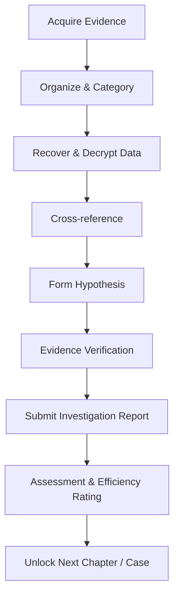
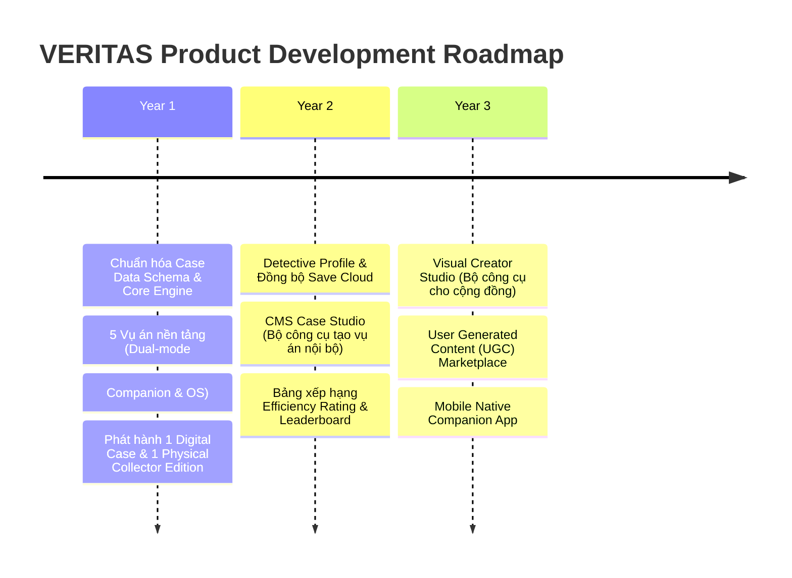

# VERITAS — Product Vision & Strategy

> **Core Positioning:** **VERITAS is an Evidence-Driven Investigation Platform.**
> 
> *Triết lý cốt lõi:* Không chỉ dừng lại ở *"Solve a mystery"* (Đoán câu đố), mà là **"Prove the truth"** (Chứng minh sự thật dựa trên chuỗi bằng chứng).

---

## 01. Product Vision & Mission

### 👁️ Vision
VERITAS là một nền tảng điều tra số (**Digital Investigation Platform**) kết hợp linh hoạt trải nghiệm vật lý và kỹ thuật số để mang đến những vụ án đòi hỏi suy luận thực sự. Người chơi không chiến thắng bằng cách đoán đúng trắc nghiệm, mà bằng cách **chứng minh kết luận của mình thông qua chuỗi bằng chứng hợp lệ**.

* **Không phải:** Solve mystery (Đoán mò đáp án).
* **Mà là:** Prove the truth (Xây dựng chuỗi lập luận chứng minh sự thật).

### 🎯 Mission
Tạo ra trải nghiệm điều tra chân thực, nơi mọi email, tin nhắn, ghi âm, hình ảnh, tài liệu pháp y và vật chứng đều đóng vai trò mắt xích trong việc tái dựng sự thật.

### 🚀 Long-term Vision
* VERITAS **không chỉ** là một board game đơn lẻ.
* VERITAS **không chỉ** là một website giải đố.
* VERITAS **là một nền tảng phát hành các vụ án điều tra** (*Investigation Publishing Platform*) sở hữu bộ công cụ xử lý vụ án (*Case Engine*) chuẩn hóa.

---

## 02. Market Positioning

Điểm tạo nên sự khác biệt vượt trội của VERITAS so với các sản phẩm trinh thám hiện có trên thị trường:

| Sản phẩm so sánh | Điểm hạn chế hiện tại | Sự vượt trội của VERITAS |
| :--- | :--- | :--- |
| **Murdle** | Thiên về puzzle logic ngắn, mang tính giải đố toán học. | **Điều tra đa lớp**, kết hợp dữ liệu số và bằng chứng thực tế có chiều sâu narrative. |
| **Chronicles of Crime** | Dùng app di động chỉ để quét QR mã hóa. | **Investigation OS** đóng vai trò là môi trường điều tra tương tác chân thực. |
| **Hunt A Killer** | Thiên hoàn toàn về hộp vật lý, chi phí sản xuất & vận chuyển cao. | **Digital-First Platform**: Chơi mượt trên Web, kết hợp bản vật lý dạng Collector Edition. |
| **Detective: A Modern Crime** | Có dữ liệu web nhưng trải nghiệm chưa phải trung tâm. | **Dual-Mode Engagement**: Hỗ trợ từ Trợ lý Companion đơn giản đến Máy trạm OS chuyên sâu. |

---

## 03. Product Pillars

5 trụ cột sản phẩm định hình toàn bộ thiết kế & trải nghiệm:

1. **Evidence Before Conclusion**
   * Mọi kết luận phải dựa trên bằng chứng. Không có đáp án đúng nếu người chơi không chứng minh được chuỗi logic.
2. **Investigation Feels Real**
   * Người chơi phải cảm thấy: *"Mình đang thực sự điều tra"*, chứ không phải *"Mình đang làm bài thi trắc nghiệm"*.
3. **Flexible Engagement Spectrum (Chế độ tương tác linh hoạt)**
   * Web không ép người chơi phải dán mắt vào màn hình. Cung cấp 2 cấp độ từ **Trợ lý số nhẹ nhàng (Companion)** đến **Máy trạm điều tra chuyên sâu (Investigation OS)**.
4. **Every Interaction Has Narrative Value**
   * Không có nút bấm hay giao diện nào chỉ để trang trí. Mỗi thao tác đều cung cấp thông tin hoặc dẫn tới quyết định điều tra.
5. **Decoupled Content Architecture (Nội dung là Sản phẩm)**
   * Hệ thống được thiết kế dạng Engine. Vụ án được đóng gói dạng Data Schema chuẩn hóa, tách biệt hoàn toàn khỏi mã nguồn ứng dụng.

---

## 04. Core Fantasy

> 🕵️‍♂️ **Core Role Fantasy:**
> 
> *"Tôi là điều tra viên của một đơn vị phân tích pháp y (Forensic Analysis Unit), được giao nhiệm vụ tái dựng sự thật từ các dữ liệu còn sót lại."*

*(Hình tượng điều tra viên pháp y hiện đại tạo cảm giác độc đáo, chuyên nghiệp và khớp hoàn hảo với gameplay phân tích dữ liệu số).*

---

## 05. Flexible Engagement Spectrum & Personas

VERITAS linh hoạt đáp ứng nhu cầu của từng nhóm người chơi thông qua **Mô hình Tương tác Kép (Dual-Layer Web Engagement)**:

```
                          MỨC ĐỘ TƯƠNG TÁC WEB
                                   │
         ┌─────────────────────────┴─────────────────────────┐
         ▼                                                   ▼
LEVEL 1: COMPANION MODE                             LEVEL 2: INVESTIGATION OS MODE
   (Light Touch - Trợ lý)                              (Deep Touch - Máy trạm)
----------------------------------                  ----------------------------------
• Nhóm Board Gamer (3-4 người)                      • Game thủ Solo / Digital Players
• Tương tác chính trên hồ sơ giấy                   • Thao tác 100% trên giao diện Web
• Web hỗ trợ:                                       • Web cung cấp:
  - Nhập mã vật chứng (Unlock)                        - Giả lập điện thoại / Email / SMS
  - Checkpoint questions theo chặng                   - Đối chiếu Timeline Clash tự động
  - Hệ thống gợi ý phân tầng (Hints)                  - Tra cứu nhật ký pháp y, mã SHA-256
  - Xác nhận bằng chứng & nộp kết luận                - Công cụ ghim nối bằng chứng
```

### Chi tiết 3 Nhóm Người Chơi (Personas):
* **The Detective (Yêu trinh thám & suy luận sâu):** Muốn phân tích logic, liên kết bằng chứng mâu thuẫn (Tối ưu cho cả Level 1 & Level 2).
* **The Board Gamer (Người chơi nhóm/vật lý):** Ưu tiên sờ cầm tài liệu giấy, tranh luận nhóm xung quanh bàn ăn (Dùng **Level 1: Companion Mode**).
* **Digital Mystery Player (Game thủ trinh thám số):** Thích trải nghiệm solo đắm chìm dạng *Her Story*, *Obra Dinn* (Dùng **Level 2: OS Mode**).

---

## 06. Gameplay Loop & Evidence Verification

### 🔄 Vòng lặp điều tra chân thực (Real Investigation Flow)



### 🔍 Cơ chế xác thực chứng cứ (Proof Mechanism)
* **Alibi Clash Detection:** Phát hiện mâu thuẫn giữa lời khai nghi phạm và bằng chứng thực tế (dữ liệu GPS, nhật ký cuộc gọi, hóa đơn...).
* **Evidence Link Matrix:** Người chơi phải chọn đúng thẻ bằng chứng đi kèm với câu trả lời để chứng minh lập luận.

### 📊 Hệ thống đánh giá hiệu suất (Investigative Efficiency Rating)
* Để ngăn chặn hành vi đoán mò (Trial-and-error), hệ thống tính điểm dựa trên:
  * **Accuracy Rate:** Độ chính xác của chuỗi chứng cứ đính kèm.
  * **Redundant Actions:** Số lần tra cứu thừa / thao tác sai hướng.
* Kết quả xếp hạng cuối vụ án: **S-Tier (Master Analyst)** $\rightarrow$ **D-Tier (Rookie)**.

---

## 07. Platform Architecture & Content Engine

Kiến trúc hệ thống tách biệt giúp dễ dàng mở rộng và bảo trì:

```
                      VERITAS PLATFORM ENGINE
                                 │
     ┌───────────────────────────┼───────────────────────────┐
     ▼                           ▼                           ▼
Case Data Schema            Investigation OS          Digital Companion
 (JSON / YAML)               (Full Web Workstation)     (Light Checkpoint UI)
     │                           │                           │
     └───────────────────────────┼───────────────────────────┘
                                 ▼
                     Core Verification Logic
                                 │
     ┌───────────────────────────┴───────────────────────────┐
     ▼                                                       ▼
CMS Case Studio (Admin/Internal)               UGC Creator Marketplace (Future)
```

---

## 08. Content Framework

Cấu trúc chuẩn hóa chiều sâu cho một vụ án (**Case Data Schema**):

* 📋 **Case Metadata:** Tên vụ án, độ khó, thời lượng dự kiến, danh mục hiện vật.
* 🎯 **Objectives & Checkpoints:** Các mục tiêu điều tra theo từng chặng.
* ⏱️ **Timeline & Alibis:** Dòng thời gian sự kiện thực tế và lời khai ngoại phạm của các nghi phạm.
* 👤 **Entities Profile:** Nạn nhân (Victim), Nghi phạm (Persons of Interest), Tổ chức (Organizations), Địa điểm (Locations).
* 📂 **Forensic Assets:**
  * Vật chứng vật lý / số (Physical / Digital Evidence).
  * Thiết bị giả lập (Phone / PC / USB dumps).
  * Dữ liệu phục hồi (Recovered chats, images, audio logs).
* 📝 **Verification & Report Sheet:** Bộ câu hỏi kiểm tra kèm mã bằng chứng xác thực bắt buộc.
* 🏆 **Evaluation & Rewards:** Thang điểm hiệu suất và phần thưởng mở khóa.

---

## 09. Business Model Strategy

Chiến lược kinh doanh **Digital-First**, giảm thiểu rào cản dòng tiền & chi phí vận hành:

$$\text{Free Tutorial Case (Web)} \longrightarrow \text{Digital Cases (\$)} \longrightarrow \text{Collector Physical Box (\$\$\$)} \longrightarrow \text{Season Pass / Expansions}$$

* **Digital-First Core:** Phát hành các vụ án số trên Web để tối ưu khả năng tiếp cận toàn cầu và chi phí vận chuyển bằng 0.
* **Premium Collector Box:** Sản xuất các bộ Physical Box giới hạn dành cho người hâm mộ muốn trải nghiệm vật lý cao cấp.
* **Pay-Per-Case:** Bán lẻ từng vụ án thay vì bắt buộc Subscription ngay từ đầu.

---

## 10. Product Roadmap



---

## 🎯 Summary Statement

> **VERITAS is an Evidence-Driven Investigation Platform.**
> 
> Với định vị **"Evidence-Driven"** cùng **Mô hình Tương tác Kép (Dual-Layer Engagement)**, VERITAS mang đến trải nghiệm điều tra chân thực nhưng linh hoạt: vừa đáp ứng độ sâu phân tích cho game thủ số trên web, vừa tôn trọng không gian trải nghiệm nhóm của người chơi board game vật lý.