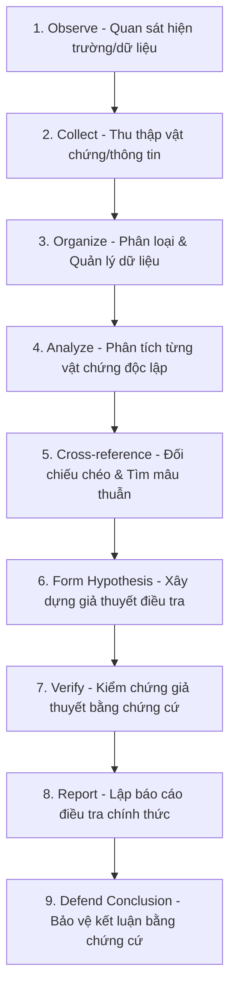

# TRIẾT LÝ ĐIỀU TRA (INVESTIGATION PHILOSOPHY) — VERITAS

> **Triết lý Cốt lõi:** **Investigation is the process of reconstructing reality through evidence.**
> 
> Trong VERITAS, người chơi không chiến thắng bằng cách đoán đúng, mà bằng cách **chứng minh kết luận của mình thông qua một chuỗi bằng chứng hợp lệ và logic**.

---

## 01. Tuyên Ngôn Triết Lý (Philosophy Statement)

VERITAS là một **Evidence-Driven Investigation Platform**.
* Mục tiêu của người chơi không phải là tìm ra đáp án nhanh nhất hay đoán trắc nghiệm đúng ngẫu nhiên.
* Mục tiêu là **tái dựng lại toàn bộ hiện thực (Reconstructing Reality)** bằng một quá trình điều tra có hệ thống.

> 💡 **Sự thật không được tạo ra trong quá trình chơi.**
> **Sự thật đã tồn tại ngay từ trước khi vụ án bắt đầu.** Người chơi không sáng tạo ra câu chuyện; họ chỉ từng bước khám phá, thu thập, đối chiếu và chứng minh hiện thực đó.

---

## 02. Sự Thật Đã Tồn Tại Trước Khi Vụ Án Bắt Đầu (Reality Exists First)

> *"The truth already exists. Players do not create it. They uncover it."*

Đây là nguyên tắc thiết kế bất biến quan trọng nhất của VERITAS. Ngay từ thời điểm một vụ án được biên soạn:
* 🎯 **Hung thủ** đã được xác định cụ thể.
* ⏱️ **Timeline** chuỗi sự kiện đã được cố định hoàn chỉnh.
* 💡 **Động cơ & Phương thức** gây án đã tồn tại rõ ràng.
* 🔗 **Quan hệ giữa các nhân vật** và mọi vật chứng đều có nguồn gốc hợp logic.

### ❌ Những Điều VERITAS Tuyệt Đối Không Làm (Design Restrictions):
* **Không có Random Endings** (Kết bài ngẫu nhiên).
* **Không thay đổi hung thủ** dựa trên lựa chọn cảm tính của người chơi.
* **Không dùng AI tự sinh đáp án** ngẫu nhiên làm mất tính logic chặt chẽ.
* **Không có Multiple Canon Endings** (Nhiều kết bài chính thống mâu thuẫn nhau).

---

## 03. Quy Trình Điều Tra 9 Bước (The 9-Step Investigation Flow)

---

## 04. Phân Loại 8 Nhóm Bằng Chứng (Evidence Taxonomy)

Trong VERITAS, **không tồn tại "vật chứng thừa/giả" vô nghĩa**. Mọi bằng chứng đưa vào vụ án đều thuộc một trong 8 nhóm phân loại chiến lược:

| Nhóm Bằng Chứng | Vai Trò Trong Điều Tra |
| :--- | :--- |
| **Relevant Evidence** | Bằng chứng trực tiếp liên quan đến vụ án/nghi phạm. |
| **Supporting Evidence** | Dữ liệu củng cố thêm cho một bằng chứng khác. |
| **Contradictory Evidence** | Bằng chứng chỉ ra sự mâu thuẫn trong lời khai (Alibi Clash). |
| **Contextual Evidence** | Dữ liệu làm rõ bối cảnh, mối quan hệ hoặc động cơ. |
| **Incomplete Evidence** | Bằng chứng bị thiếu một phần thông tin (cần tìm mảnh ghép còn lại). |
| **Corrupted Evidence** | Dữ liệu bị hư hỏng/mã hóa (cần khôi phục bằng công cụ OS). |
| **Hidden Evidence** | Bằng chứng ẩn giấu trong metadata, tin nhắn ẩn, hoặc file sâu. |
| **Recovered Evidence** | Dữ liệu được phục hồi từ thiết bị thu giữ (Phone/Laptop dump). |

---

## 05. Nguyên Tắc Công Bằng & Tính Tái Lập (Reproducible Truth)

1. **Self-Contained Data:** Mọi thông tin cần thiết đều nằm trong vụ án.
2. **Transparent Logic:** Khi nhìn lại đáp án, người chơi cảm nhận: *"Mọi manh mối đều đã ở đó"*.
3. **No Artificial Difficulty:** Độ khó đến từ tư duy logic, không đến từ pixel hunting hay thủ thuật đánh đố.
4. **Reproducible Truth:** Nếu hai người chơi độc lập có cùng bộ dữ liệu, họ phải có khả năng suy luận ra cùng một kết luận duy nhất.
