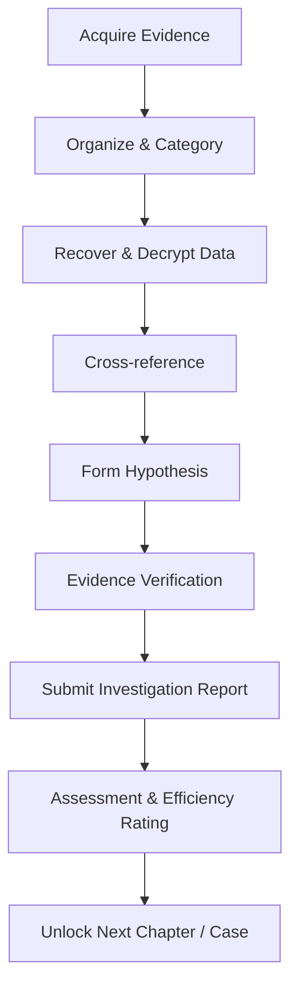
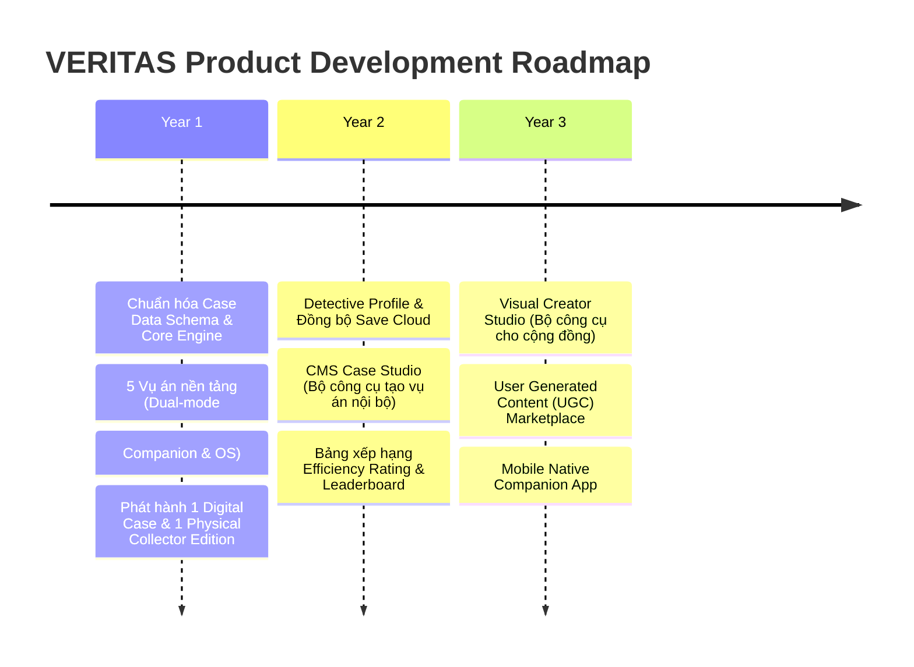
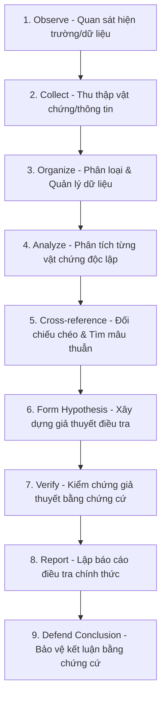

<!-- START OF MERGED FILE: 00_PROJECT/01_product_vision.md -->

---
# TỔNG QUAN DỰ ÁN — VERITAS

> **Định vị Cốt lõi:** **VERITAS là một Nền tảng Điều tra Số Dựa trên Bằng chứng (Evidence-Driven Digital Investigation Platform).**
> 
> *Khẩu hiệu:* *"Người chơi không chiến thắng bằng cách đoán đúng sự thật. Họ chiến thắng bằng cách chứng minh nó."*

---

## 01. Tóm Tắt Dự Án (Executive Summary)

**VERITAS** là một nền tảng điều tra kỹ thuật số đa thế hệ, kết hợp giữa trải nghiệm chơi vật lý (Board Game) và môi trường máy trạm điều tra pháp y kỹ thuật số (Investigation OS). 

Dự án ra đời nhằm giải quyết căn bệnh "đoán mò" (trial-and-error) của các tựa game trinh thám truyền thống bằng cách thiết lập một quy trình chứng minh sự thật dựa hoàn toàn vào chuỗi bằng chứng logic (**Chuỗi Lập Luận Chứng Cứ**).

---

## 02. Định Danh Cốt Lõi & Trải Nghiệm Nhập Vai (Role Fantasy)

* 🎭 **Hình tượng nhập vai:** Người chơi nhập vai vào **Điều tra viên thuộc Đơn vị Phân tích Pháp y Số (Forensic Analysis Unit)**, được giao nhiệm vụ tái dựng sự thật lịch sử từ các mảnh ghép dữ liệu còn sót lại (*Tái dựng Hiện thực*).
* 👁️ **Mục tiêu cốt lõi:** Không phải sáng tạo hay thay đổi kết bài, mà là **khám phá và chứng minh duy nhất một sự thật đã tồn tại từ trước**.

---

## 03. Điểm Khác Biệt Cốt Lõi (USP - Unique Selling Points)

1. **Bằng Chứng Trước Kết Luận (Evidence Before Conclusion):** Mọi báo cáo điều tra đều bắt buộc đính kèm mã chứng cứ xác thực hợp lệ (Alibi Clash - Mâu thuẫn ngoại phạm, nhật ký GPS, dữ liệu SMS). Không thưởng điểm cho việc chọn đúng đáp án ngẫu nhiên.
2. **Mô Hình Tương Tác Kép Linh Hoạt (Dual-Layer Engagement Spectrum):**
   * **Cấp độ 1: Companion Mode (Trợ lý linh hoạt):** Web đóng vai trò Game Master / Trợ lý cho nhóm người chơi Board Game vật lý quanh bàn.
   * **Cấp độ 2: Investigation OS Workstation (Máy trạm chuyên sâu):** Web là môi trường máy trạm phân tích log SHA-256, giả lập điện thoại/email, soi timeline mâu thuẫn dành cho game thủ Solo trên máy tính.
3. **Kiến Trúc Nội Dung Tách Biệt (Decoupled Content Architecture):** Nội dung vụ án hoàn toàn tách biệt với mã nguồn ứng dụng thông qua định dạng dữ liệu chuẩn hóa **Case Data Schema (JSON/YAML)**, sẵn sàng mở rộng cho cộng đồng tự tạo vụ án (UGC) trong tương lai.
4. **Hệ Thống Đánh Giá Hiệu Suất Điều Tra (Investigative Efficiency Rating):** Hệ thống tính điểm S/A/B/C/D đánh giá độ chính xác của lập luận và số thao tác thừa để ngăn chặn hành vi đoán mò.

---

## 04. Kiến Trúc Hệ Thống & Công Nghệ (Tech Stack)

```
                              NỀN TẢNG VERITAS
                                     │
         ┌───────────────────────────┴───────────────────────────┐
         ▼                                                       ▼
  GIAO DIỆN NGƯỜI DÙNG (Web OS)                           BỘ XỬ LÝ & BACKEND
  -----------------------------                           ------------------
  • Next.js 16 (App Router)                               • Bộ xử lý Vụ án (Decoupled Case Engine)
  • React 19 + Tailwind CSS v4                            • Bộ xác thực Chứng cứ (Graph Match Engine)
  • Zustand (Quản lý trạng thái local)                    • Supabase (Postgres + RLS + Synchronize Cloud)
  • Dexie.js (Lưu trữ offline IndexDB)                    • Mạng lưới Edge Vercel
```

---

## 05. Hệ Sinh Thái & Mô Hình Kinh Doanh (Business Model)

* **Mô hình Phễu:** Digital-First (Bán lẻ từng vụ án số) $\rightarrow$ Collector Physical Edition Box (Bản hộp vật lý cao cấp) $\rightarrow$ Season Pass.
* **Hệ sinh thái sản phẩm:**
  * **Companion & OS Web App:** Giao diện điều tra người dùng.
  * **CMS Case Studio:** Bộ công cụ biên soạn vụ án nội bộ.
  * **Creator Marketplace:** Chợ chia sẻ vụ án do cộng đồng tạo ra (Roadmap Year 3).

---

## 06. Danh Mục Tài Liệu Cốt Lõi

- 📑 **Tầm nhìn & Định hướng:** [01_product_vision.md](./01_product_vision.md)
- 🌎 **Thế giới & Quy tắc:** [02_world_building.md](./02_world_building.md)
- ⚖️ **Triết lý Điều tra:** [01_product_vision.md](./01_product_vision.md)

---

<!-- END OF MERGED FILE: {src} -->

---

<!-- START OF MERGED FILE: 01_PRODUCT/01_product_vision.md -->

---
# VERITAS — Product Vision & Strategy

> **Core Positioning:** **VERITAS is an Evidence-Driven Investigation Platform.**
> 
> *Triết lý cốt lõi:* Không chỉ dừng lại ở *"Solve a mystery"* (Đoán câu đố), mà là **"Prove the truth"** (Chứng minh sự thật dựa trên chuỗi bằng chứng).

---

## 01. Product Vision & Mission

### 👁️ Vision
VERITAS là một nền tảng điều tra số (**Digital Investigation Platform**) kết hợp linh hoạt trải nghiệm vật lý và kỹ thuật số để mang đến những vụ án đòi hỏi suy luận thực sự. Người chơi không chiến thắng bằng cách đoán đúng trắc nghiệm, mà bằng cách **chứng minh kết luận của mình thông qua chuỗi bằng chứng hợp lệ**.

* **Không phải:** Solve mystery (Đoán mò đáp án).
* **Mà là:** Prove the truth (Xây dựng chuỗi lập luận chứng minh sự thật).

### 🎯 Mission
Tạo ra trải nghiệm điều tra chân thực, nơi mọi email, tin nhắn, ghi âm, hình ảnh, tài liệu pháp y và vật chứng đều đóng vai trò mắt xích trong việc tái dựng sự thật.

### 🚀 Long-term Vision
* VERITAS **không chỉ** là một board game đơn lẻ.
* VERITAS **không chỉ** là một website giải đố.
* VERITAS **là một nền tảng phát hành các vụ án điều tra** (*Investigation Publishing Platform*) sở hữu bộ công cụ xử lý vụ án (*Case Engine*) chuẩn hóa.

---

## 02. Market Positioning

Điểm tạo nên sự khác biệt vượt trội của VERITAS so với các sản phẩm trinh thám hiện có trên thị trường:

| Sản phẩm so sánh | Điểm hạn chế hiện tại | Sự vượt trội của VERITAS |
| :--- | :--- | :--- |
| **Murdle** | Thiên về puzzle logic ngắn, mang tính giải đố toán học. | **Điều tra đa lớp**, kết hợp dữ liệu số và bằng chứng thực tế có chiều sâu narrative. |
| **Chronicles of Crime** | Dùng app di động chỉ để quét QR mã hóa. | **Investigation OS** đóng vai trò là môi trường điều tra tương tác chân thực. |
| **Hunt A Killer** | Thiên hoàn toàn về hộp vật lý, chi phí sản xuất & vận chuyển cao. | **Digital-First Platform**: Chơi mượt trên Web, kết hợp bản vật lý dạng Collector Edition. |
| **Detective: A Modern Crime** | Có dữ liệu web nhưng trải nghiệm chưa phải trung tâm. | **Dual-Mode Engagement**: Hỗ trợ từ Trợ lý Companion đơn giản đến Máy trạm OS chuyên sâu. |

---

## 03. Product Pillars

5 trụ cột sản phẩm định hình toàn bộ thiết kế & trải nghiệm:

1. **Evidence Before Conclusion**
   * Mọi kết luận phải dựa trên bằng chứng. Không có đáp án đúng nếu người chơi không chứng minh được chuỗi logic.
2. **Investigation Feels Real**
   * Người chơi phải cảm thấy: *"Mình đang thực sự điều tra"*, chứ không phải *"Mình đang làm bài thi trắc nghiệm"*.
3. **Flexible Engagement Spectrum (Chế độ tương tác linh hoạt)**
   * Web không ép người chơi phải dán mắt vào màn hình. Cung cấp 2 cấp độ từ **Trợ lý số nhẹ nhàng (Companion)** đến **Máy trạm điều tra chuyên sâu (Investigation OS)**.
4. **Every Interaction Has Narrative Value**
   * Không có nút bấm hay giao diện nào chỉ để trang trí. Mỗi thao tác đều cung cấp thông tin hoặc dẫn tới quyết định điều tra.
5. **Decoupled Content Architecture (Nội dung là Sản phẩm)**
   * Hệ thống được thiết kế dạng Engine. Vụ án được đóng gói dạng Data Schema chuẩn hóa, tách biệt hoàn toàn khỏi mã nguồn ứng dụng.

---

## 04. Core Fantasy

> 🕵️‍♂️ **Core Role Fantasy:**
> 
> *"Tôi là điều tra viên của một đơn vị phân tích pháp y (Forensic Analysis Unit), được giao nhiệm vụ tái dựng sự thật từ các dữ liệu còn sót lại."*

*(Hình tượng điều tra viên pháp y hiện đại tạo cảm giác độc đáo, chuyên nghiệp và khớp hoàn hảo với gameplay phân tích dữ liệu số).*

---

## 05. Flexible Engagement Spectrum & Personas

VERITAS linh hoạt đáp ứng nhu cầu của từng nhóm người chơi thông qua **Mô hình Tương tác Kép (Dual-Layer Web Engagement)**:

```
                          MỨC ĐỘ TƯƠNG TÁC WEB
                                   │
         ┌─────────────────────────┴─────────────────────────┐
         ▼                                                   ▼
LEVEL 1: COMPANION MODE                             LEVEL 2: INVESTIGATION OS MODE
   (Light Touch - Trợ lý)                              (Deep Touch - Máy trạm)
----------------------------------                  ----------------------------------
• Nhóm Board Gamer (3-4 người)                      • Game thủ Solo / Digital Players
• Tương tác chính trên hồ sơ giấy                   • Thao tác 100% trên giao diện Web
• Web hỗ trợ:                                       • Web cung cấp:
  - Nhập mã vật chứng (Unlock)                        - Giả lập điện thoại / Email / SMS
  - Checkpoint questions theo chặng                   - Đối chiếu Timeline Clash tự động
  - Hệ thống gợi ý phân tầng (Hints)                  - Tra cứu nhật ký pháp y, mã SHA-256
  - Xác nhận bằng chứng & nộp kết luận                - Công cụ ghim nối bằng chứng
```

### Chi tiết 3 Nhóm Người Chơi (Personas):
* **The Detective (Yêu trinh thám & suy luận sâu):** Muốn phân tích logic, liên kết bằng chứng mâu thuẫn (Tối ưu cho cả Level 1 & Level 2).
* **The Board Gamer (Người chơi nhóm/vật lý):** Ưu tiên sờ cầm tài liệu giấy, tranh luận nhóm xung quanh bàn ăn (Dùng **Level 1: Companion Mode**).
* **Digital Mystery Player (Game thủ trinh thám số):** Thích trải nghiệm solo đắm chìm dạng *Her Story*, *Obra Dinn* (Dùng **Level 2: OS Mode**).

---

## 06. Gameplay Loop & Evidence Verification

### 🔄 Vòng lặp điều tra chân thực (Real Investigation Flow)



### 🔍 Cơ chế xác thực chứng cứ (Proof Mechanism)
* **Alibi Clash Detection:** Phát hiện mâu thuẫn giữa lời khai nghi phạm và bằng chứng thực tế (dữ liệu GPS, nhật ký cuộc gọi, hóa đơn...).
* **Evidence Link Matrix:** Người chơi phải chọn đúng thẻ bằng chứng đi kèm với câu trả lời để chứng minh lập luận.

### 📊 Hệ thống đánh giá hiệu suất (Investigative Efficiency Rating)
* Để ngăn chặn hành vi đoán mò (Trial-and-error), hệ thống tính điểm dựa trên:
  * **Accuracy Rate:** Độ chính xác của chuỗi chứng cứ đính kèm.
  * **Redundant Actions:** Số lần tra cứu thừa / thao tác sai hướng.
* Kết quả xếp hạng cuối vụ án: **S-Tier (Master Analyst)** $\rightarrow$ **D-Tier (Rookie)**.

---

## 07. Platform Architecture & Content Engine

Kiến trúc hệ thống tách biệt giúp dễ dàng mở rộng và bảo trì:

```
                      VERITAS PLATFORM ENGINE
                                 │
     ┌───────────────────────────┼───────────────────────────┐
     ▼                           ▼                           ▼
Case Data Schema            Investigation OS          Digital Companion
 (JSON / YAML)               (Full Web Workstation)     (Light Checkpoint UI)
     │                           │                           │
     └───────────────────────────┼───────────────────────────┘
                                 ▼
                     Core Verification Logic
                                 │
     ┌───────────────────────────┴───────────────────────────┐
     ▼                                                       ▼
CMS Case Studio (Admin/Internal)               UGC Creator Marketplace (Future)
```

---

## 08. Content Framework

Cấu trúc chuẩn hóa chiều sâu cho một vụ án (**Case Data Schema**):

* 📋 **Case Metadata:** Tên vụ án, độ khó, thời lượng dự kiến, danh mục hiện vật.
* 🎯 **Objectives & Checkpoints:** Các mục tiêu điều tra theo từng chặng.
* ⏱️ **Timeline & Alibis:** Dòng thời gian sự kiện thực tế và lời khai ngoại phạm của các nghi phạm.
* 👤 **Entities Profile:** Nạn nhân (Victim), Nghi phạm (Persons of Interest), Tổ chức (Organizations), Địa điểm (Locations).
* 📂 **Forensic Assets:**
  * Vật chứng vật lý / số (Physical / Digital Evidence).
  * Thiết bị giả lập (Phone / PC / USB dumps).
  * Dữ liệu phục hồi (Recovered chats, images, audio logs).
* 📝 **Verification & Report Sheet:** Bộ câu hỏi kiểm tra kèm mã bằng chứng xác thực bắt buộc.
* 🏆 **Evaluation & Rewards:** Thang điểm hiệu suất và phần thưởng mở khóa.

---

## 09. Business Model Strategy

Chiến lược kinh doanh **Digital-First**, giảm thiểu rào cản dòng tiền & chi phí vận hành:

$$\text{Free Tutorial Case (Web)} \longrightarrow \text{Digital Cases (\$)} \longrightarrow \text{Collector Physical Box (\$\$\$)} \longrightarrow \text{Season Pass / Expansions}$$

* **Digital-First Core:** Phát hành các vụ án số trên Web để tối ưu khả năng tiếp cận toàn cầu và chi phí vận chuyển bằng 0.
* **Premium Collector Box:** Sản xuất các bộ Physical Box giới hạn dành cho người hâm mộ muốn trải nghiệm vật lý cao cấp.
* **Pay-Per-Case:** Bán lẻ từng vụ án thay vì bắt buộc Subscription ngay từ đầu.

---

## 10. Product Roadmap



---

## 🎯 Summary Statement

> **VERITAS is an Evidence-Driven Investigation Platform.**
> 
> Với định vị **"Evidence-Driven"** cùng **Mô hình Tương tác Kép (Dual-Layer Engagement)**, VERITAS mang đến trải nghiệm điều tra chân thực nhưng linh hoạt: vừa đáp ứng độ sâu phân tích cho game thủ số trên web, vừa tôn trọng không gian trải nghiệm nhóm của người chơi board game vật lý.
---

<!-- END OF MERGED FILE: {src} -->

---

<!-- START OF MERGED FILE: 01_PRODUCT/01_product_vision.md -->

---
# TRIẾT LÝ ĐIỀU TRA (INVESTIGATION PHILOSOPHY) — VERITAS

> **Triết lý Cốt lõi:** **Investigation is the process of reconstructing reality through evidence.**
> 
> Trong VERITAS, người chơi không chiến thắng bằng cách đoán đúng, mà bằng cách **chứng minh kết luận của mình thông qua một chuỗi bằng chứng hợp lệ và logic**.

---

## 01. Tuyên Ngôn Triết Lý (Philosophy Statement)

VERITAS là một **Evidence-Driven Investigation Platform**.
* Mục tiêu của người chơi không phải là tìm ra đáp án nhanh nhất hay đoán trắc nghiệm đúng ngẫu nhiên.
* Mục tiêu là **tái dựng lại toàn bộ hiện thực (Reconstructing Reality)** bằng một quá trình điều tra có hệ thống.

> 💡 **Sự thật không được tạo ra trong quá trình chơi.**
> **Sự thật đã tồn tại ngay từ trước khi vụ án bắt đầu.** Người chơi không sáng tạo ra câu chuyện; họ chỉ từng bước khám phá, thu thập, đối chiếu và chứng minh hiện thực đó.

---

## 02. Sự Thật Đã Tồn Tại Trước Khi Vụ Án Bắt Đầu (Reality Exists First)

> *"The truth already exists. Players do not create it. They uncover it."*

Đây là nguyên tắc thiết kế bất biến quan trọng nhất của VERITAS. Ngay từ thời điểm một vụ án được biên soạn:
* 🎯 **Hung thủ** đã được xác định cụ thể.
* ⏱️ **Timeline** chuỗi sự kiện đã được cố định hoàn chỉnh.
* 💡 **Động cơ & Phương thức** gây án đã tồn tại rõ ràng.
* 🔗 **Quan hệ giữa các nhân vật** và mọi vật chứng đều có nguồn gốc hợp logic.

### ❌ Những Điều VERITAS Tuyệt Đối Không Làm (Design Restrictions):
* **Không có Random Endings** (Kết bài ngẫu nhiên).
* **Không thay đổi hung thủ** dựa trên lựa chọn cảm tính của người chơi.
* **Không dùng AI tự sinh đáp án** ngẫu nhiên làm mất tính logic chặt chẽ.
* **Không có Multiple Canon Endings** (Nhiều kết bài chính thống mâu thuẫn nhau).

---

## 03. Quy Trình Điều Tra 9 Bước (The 9-Step Investigation Flow)



---

## 04. Phân Loại 8 Nhóm Bằng Chứng (Evidence Taxonomy)

Trong VERITAS, **không tồn tại "vật chứng thừa/giả" vô nghĩa**. Mọi bằng chứng đưa vào vụ án đều thuộc một trong 8 nhóm phân loại chiến lược:

| Nhóm Bằng Chứng | Vai Trò Trong Điều Tra |
| :--- | :--- |
| **Relevant Evidence** | Bằng chứng trực tiếp liên quan đến vụ án/nghi phạm. |
| **Supporting Evidence** | Dữ liệu củng cố thêm cho một bằng chứng khác. |
| **Contradictory Evidence** | Bằng chứng chỉ ra sự mâu thuẫn trong lời khai (Alibi Clash). |
| **Contextual Evidence** | Dữ liệu làm rõ bối cảnh, mối quan hệ hoặc động cơ. |
| **Incomplete Evidence** | Bằng chứng bị thiếu một phần thông tin (cần tìm mảnh ghép còn lại). |
| **Corrupted Evidence** | Dữ liệu bị hư hỏng/mã hóa (cần khôi phục bằng công cụ OS). |
| **Hidden Evidence** | Bằng chứng ẩn giấu trong metadata, tin nhắn ẩn, hoặc file sâu. |
| **Recovered Evidence** | Dữ liệu được phục hồi từ thiết bị thu giữ (Phone/Laptop dump). |

---

## 05. Nguyên Tắc Công Bằng & Tính Tái Lập (Reproducible Truth)

1. **Self-Contained Data:** Mọi thông tin cần thiết đều nằm trong vụ án.
2. **Transparent Logic:** Khi nhìn lại đáp án, người chơi cảm nhận: *"Mọi manh mối đều đã ở đó"*.
3. **No Artificial Difficulty:** Độ khó đến từ tư duy logic, không đến từ pixel hunting hay thủ thuật đánh đố.
4. **Reproducible Truth:** Nếu hai người chơi độc lập có cùng bộ dữ liệu, họ phải có khả năng suy luận ra cùng một kết luận duy nhất.

---

<!-- END OF MERGED FILE: {src} -->

---

<!-- START OF MERGED FILE: 01_PRODUCT/01_product_vision.md -->

---
# KHUNG GAMEPLAY (GAMEPLAY FRAMEWORK) — VERITAS

> **Triết lý Cốt lõi:** Gameplay của VERITAS được xây dựng để mô phỏng chính xác quy trình tư duy của một Điều tra viên Pháp y Số, loại bỏ hoàn toàn tính may rủi hay giải đố rời rạc.

---

## 01. Vòng Lặp Điều Tra 9 Bước (The 9-Step Investigation Loop)

Vòng lặp điều tra 9 bước được định nghĩa chi tiết tại **[01_product_vision.md](./01_product_vision.md#03-quy-trình-điều-tra-9-bước)** (Section 03). File này làm tài liệu tham khảo nhanh.

---

## 02. Phân Tách 2 Cấp Độ Tương Tác (Dual-Layer Engagement)

Gameplay thích ứng linh hoạt theo 2 chế độ:

| Đặc tính | Level 1: Companion Mode (Trợ lý linh hoạt) | Level 2: Investigation OS Mode (Máy trạm chuyên sâu) |
| :--- | :--- | :--- |
| **Đối tượng** | Nhóm 3-4 người chơi Board Game quanh bàn. | Game thủ Solo chơi trên Web / Digital Case. |
| **Giao diện** | Giao diện di động/tablet tối giản, trực quan. | Giao diện Desktop đa cửa sổ, đầy đủ công cụ pháp y. |
| **Thao tác chính**| Nhập mã hiện vật, xem gợi ý, trả lời Checkpoints. | Khôi phục dữ liệu hỏng, soi mã SHA-256, dựng Timeline Clash. |
| **Trải nghiệm** | Tôn trọng sự tương tác giữa người với người. | Đắm chìm vào cảm giác máy trạm chuyên nghiệp. |

---

## 03. Cơ Chế Chống Đoán Mò (Anti-Guessing Engine)

* **Evidence Mandatory Rule:** Chọn đúng tên hung thủ nhưng không đính kèm mã bằng chứng mâu thuẫn $\rightarrow$ **Báo cáo bị Reject (Bị từ chối)**.
* **Efficiency Rating Penalty:** Mỗi thao tác đoán mò trắc nghiệm nhiều lần hoặc thử mã bừa bãi sẽ bị trừ điểm hiệu suất điều tra.

---

<!-- END OF MERGED FILE: {src} -->

---

<!-- START OF MERGED FILE: 00_PROJECT/01_product_vision.md -->

---
# Các Tính Năng Hiện Có Trên Hệ Thống VERITAS OS

Tài liệu này thuyết minh chi tiết cách vận hành và mã nguồn của từng tính năng chính trong hệ thống máy trạm điều tra VERITAS OS.

---

## 1. Trang Chủ & Smart Sticky Header (`/`)
* **Smart Sticky Navigation**: Thanh điều hướng tự động ẩn đi khi người chơi cuộn chuột xuống dưới đọc nội dung để nhường tầm mắt cho bối cảnh truyện, và tự trượt xuất hiện trở lại khi người dùng cuộn nhẹ chuột lên trên.
* **Story Hook (NX-4471)**: Phân đoạn giới thiệu bối cảnh vụ án mạng tại Cầu cảng số 9, tạo bối cảnh thám tử nhập vai hấp dẫn.
* **Interactive Product Showcase**: Trình diễn so sánh 2 cột động giữa Hiện vật vật lý ngoài đời (Dossier giấy, Burner Phone thật, Chìa khóa đồng đúc) và Trình xử lý kỹ thuật tương ứng trên Web.
* **FAQ Accordion**: Câu hỏi thường gặp có khả năng sụp/mở mượt mà bằng CSS.

---

## 2. Cổng Kích Hoạt Vụ Án (`/activate`)
* **Diagnostic Boot Sequence**: Khi người dùng nhấn nút chạy máy trạm, giao diện mô phỏng một dòng lệnh boot khởi động quét hệ thống phần cứng.
* **Unlock Input**: Nhập mã số in trong hộp game vật lý (mã demo: `NX-4471`) để kích hoạt vụ án và mở khóa truy cập vào `/dashboard`.

---

## 3. Không Gian Làm Việc Pháp Y (`/evidence`)
* **Phân Loại Danh Mục Tang Vật**: Tự động nhóm các bằng chứng thu thập được thành 4 nhóm trực quan:
  1. *Digital Devices* (Thiết bị số: Điện thoại, Laptop)
  2. *Documents* (Tài liệu: Hợp đồng, Email, Tin nhắn)
  3. *Audio Evidence* (Ghi âm tang vật)
  4. *Location Evidence* (Dữ liệu định vị GPS)
* **Phone Simulator (`/evidence/[id]`)**:
  * Trình giả lập điện thoại di động Nokia/Burner phone cổ điển với các ứng dụng:
    * *Tin nhắn*: Trích xuất các cuộc đối thoại, hiển thị tin nhắn chưa đọc hoặc tin nhắn mã khóa.
    * *Lịch sử duyệt web*: Xem các đường link trang nội bộ bến cảng mà nạn nhân đã truy cập trước khi mất tích.
    * *Thư viện ảnh*: Phục hồi các file ảnh chụp thực địa.
    * *Danh sách cuộc gọi*: Nhật ký cuộc gọi và ghi nhận cell tower.

---

## 4. Công Cụ Chuỗi Thời Gian Ngoại Phạm (`/trace`)
* **Suspect Filters**: Hỗ trợ chọn xem và so sánh dòng thời gian di chuyển/lời khai của 3 nhân vật: nạn nhân Thomas Vance, quản lý V. Marsh, và Quản đốc.
* **Clash Detection (Phát hiện Mâu Thuẫn)**: Người chơi lấy các mảnh ghép bằng chứng từ Deck bên phải thả vào các ô trống trên trục dọc. Nếu lời khai ngoại phạm của nghi phạm mâu thuẫn trực tiếp với định vị GPS hay file ghi âm thực tế, hệ thống sẽ chớp đỏ báo động **Alibi Clash** kèm gợi ý cảnh báo từ Trợ lý Minh.
* **Solved State**: Khi hoàn thành đúng toàn bộ chuỗi thời gian, dòng thời gian sẽ tự động khóa và đồng bộ với hệ thống.

---

## 5. Tối Giản Hóa Giao Diện & Tắt Chi Tiết Pháp Y
* **Collapsible Sidebars**: Trên giao diện máy tính Desktop, người chơi có thể bấm hai nút đầu trang để thu gọn thanh danh sách tang vật bên trái và thanh Trợ lý điều phối bên phải để tối ưu hóa không gian làm việc.
* **Forensic Detail Toggle**: Khi chuyển trạng thái sang **Tắt**, toàn bộ mã băm SHA-256 phức tạp, bảng thông số IMEI/OS/SIM của thiết bị, và nhật ký giám sát tang vật rườm rà sẽ được giấu kín khỏi màn hình của người chơi để chống ngợp thông tin, chỉ hiện lại khi bấm **Bật**.

---

<!-- END OF MERGED FILE: {src} -->

---

<!-- START OF MERGED FILE: 00_PROJECT/01_product_vision.md -->

---
# LỘ TRÌNH PHÁT TRIỂN TỔNG THỂ (MASTER ROADMAP) — VERITAS

Tài liệu này quy định chi tiết các giai đoạn chiến lược phát triển sản phẩm VERITAS từ Năm 1 đến Năm 3.

---

## 📌 Giai Đoạn 1: Nền Tảng & Bộ Xử Lý Cốt Lõi (Năm 1)

### 🎯 Mục tiêu cốt lõi:
Hoàn thiện khung dữ liệu chuẩn hóa vụ án và ra mắt sản phẩm thương mại đầu tiên.

* 🛠️ **Chuẩn hóa Case Data Schema (JSON/YAML):** Định dạng cấu trúc vụ án cho dữ liệu bằng chứng, nghi phạm, timeline mâu thuẫn và chuỗi xác thực.
* 📦 **Sản xuất 5 Vụ án nền tảng:**
  * *Vụ án 000 (Case 000):* Free Diagnostic Tutorial (Dành cho người chơi trải nghiệm miễn phí).
  * *Vụ án 001 - 003:* Các vụ án số phát hành trên Web (Digital Cases).
  * *Vụ án 004:* 1 Bản Hộp Vật Lý Cao Cấp (Physical Collector Edition Box).
* 💻 **Triển khai Web Platform 2 Cấp Độ:** Hoàn thiện giao diện **Companion Mode** (Trợ lý cho Board Game) và **Investigation OS Mode** (Máy trạm cho chơi Solo).

---

## 📌 Giai Đoạn 2: Mở Rộng Nền Tảng & Hệ Thống (Năm 2)

### 🎯 Mục tiêu cốt lõi:
Tăng tính gắn kết người dùng và xây dựng bộ công cụ phát hành nội bộ.

* 👤 **Hồ sơ Điều tra viên (Detective Profile):** Hệ thống danh hiệu, huy hiệu phá án và lưu trữ đám mây (Save Cloud Sync).
* 🛠️ **CMS Case Studio (Nội bộ):** Giao diện quản trị đồ họa giúp đội ngũ biên kịch và thiết kế game lắp ráp vụ án mới mà không cần can thiệp code.
* 📊 **Bảng Xếp Hạng Efficiency Rating:** Vinh danh những điều tra viên có chuỗi lập luận chính xác nhất và số thao tác thừa ít nhất.

---

## 📌 Giai Đoạn 3: Hệ Sinh Thái & Cộng Đồng (Năm 3)

### 🎯 Mục tiêu cốt lõi:
Mở rộng VERITAS thành Nền tảng Phát hành Vụ án (Investigation Publishing Platform).

* 🎨 **Visual Creator Studio (Công khai):** Bộ công cụ trực quan cho phép cộng đồng tự sáng tạo vụ án điều tra của riêng mình.
* 🛒 **UGC Creator Marketplace:** Sàn giao dịch cho phép người sáng tạo nội dung phát hành và bán các vụ án do họ tự thiết kế.
* 📱 **Mobile Native Companion App:** Ứng dụng di động chuyên biệt tối ưu cho người chơi board game vật lý.
* 🏆 **Sự Kiện Theo Mùa (Seasonal Events):** Các vụ án sự kiện đếm ngược thời gian thực dành cho cộng đồng toàn cầu.

---

<!-- END OF MERGED FILE: {src} -->

---

<!-- START OF MERGED FILE: 00_PROJECT/01_product_vision.md -->

---
# LỊCH SỬ CẬP NHẬT (CHANGELOG) — VERITAS

Toàn bộ các thay đổi và tiến trình phát triển kiến trúc tài liệu, hệ thống của dự án VERITAS sẽ được ghi nhận tại đây.

---

## [0.1.0] - 21/07/2026

### 🛠️ Đã thêm (Added)
* Khởi tạo **Hệ thống Kiến trúc Tài liệu 12 Phân khu** (từ `00_PROJECT` đến `99_REFERENCE`).
* Tối ưu hóa và chuẩn hóa 3 tài liệu định hướng sản phẩm cốt lõi:
  * [01_product_vision.md](./01_product_vision.md): Tầm nhìn, sứ mệnh, mô hình kinh doanh và Roadmap 3 năm.
  * [02_world_building.md](./02_world_building.md): Thế giới hư cấu hiện đại (Fictional Reality), địa điểm sinh bằng chứng và quy tắc dấu vết số.
  * [01_product_vision.md](./01_product_vision.md): Triết lý *Sự thật đã tồn tại*, *Tái dựng hiện thực*, phân loại 8 nhóm bằng chứng và mô hình tương tác kép.
* Chạy thử nghiệm thành công máy trạm điều tra cục bộ (Dev Server Next.js 16 / Turbopack tại local port 3000).

---

## [0.0.1] - 20/07/2026

### 🛠️ Khởi tạo (Initial)
* Thiết lập dự án máy trạm trinh thám VERITAS OS (`/evidence`, `/trace`, `/activate`).
* Đơn giản hóa chi tiết pháp y (Forensic Detail Toggle) và collapsible sidebars cho giao diện máy tính.

---

<!-- END OF MERGED FILE: {src} -->
