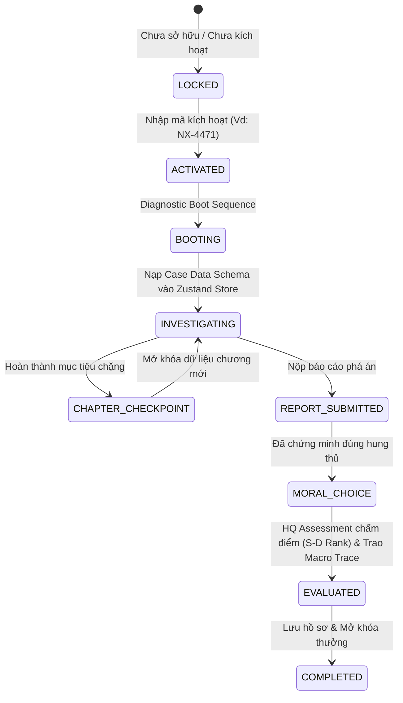

# ĐẶC TẢ HỆ THỐNG VỤ ÁN (CASE SYSTEM) — VERITAS

> **Nhiệm vụ Hệ thống:** Quản lý toàn bộ vòng đời vụ án, cổng kích hoạt mã hiện vật, nạp Case Data Schema, hệ thống 3-Tier Trace và cơ chế Lựa chọn Hậu phá án A/B (Moral Aftermath Choice).

---

## 01. Hệ Thống 3 Tầng Trace (3-Tier Trace System)

Mỗi vụ án trong VERITAS vừa là một cuộc điều tra độc lập vừa là một mắt xích trong mạng lưới vĩ mô:

```
[TẦNG 1: Direct Trace]     ──► Ai giết ai? Động cơ cá nhân & Vật chứng trực tiếp.
                                       │
[TẦNG 2: Network Trace]    ──► Liên kết đến 1 trong 5 Quân Cờ (Mã, Pháo, Xe, Tượng, Sĩ).
                                       │
[TẦNG 3: Macro Masterpiece] ──► Thu thập Mảnh ghép Tối thượng (IP, Chữ ký số, Tọa độ bản đồ).
                                       │
                                       ▼
                            🎯 RÒ RỈ DANH TÍNH ÓN TRÙM
```

---

## 02. Cơ Chế Lựa Chọn Hậu Phá Án A/B (Moral Aftermath Choice)

* **Nguyên tắc giữ nguyên "One Canon Truth":** Lựa chọn A/B **không thay đổi hung thủ hay sự thật lịch sử**. Sự thật là cố định 100%. Lựa chọn A/B xảy ra **sau khi đã chứng minh đúng hung thủ**.
* **Tác động của Lựa chọn:**
  * Thay đổi tập hồ sơ đoạn kết (Epilogue Text).
  * Cập nhật chỉ số thiên hướng trên Thẻ Căn Cước (`Lawful Investigator` vs `Moral Vigilante`).
  * Cả 2 lựa chọn A và B đều mở khóa cùng 1 **Mảnh ghép Tối thượng (Macro Trace Piece)** để tiến tới vụ án triệt hạ Ông Trùm.

---

## 03. Vòng Đời Vụ Án (Case Lifecycle States)

