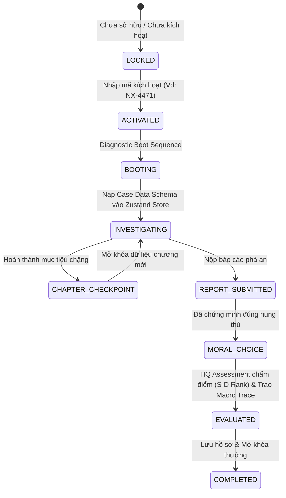

<!-- START OF MERGED FILE: 02_SYSTEMS/README.md -->

---
# MỤC LỤC ĐẶC TẢ HỆ THỐNG (SYSTEMS SPECIFICATION INDEX) — VERITAS

Tài liệu này tổng hợp đặc tả kỹ thuật chi tiết cho 15 hệ thống vận hành cốt lõi của máy trạm và ứng dụng VERITAS.

---

## 📋 Danh Mục 15 Hệ Thống Chi Tiết

| Tệp Đặc Tả | Tên Hệ Thống | Chức Năng Cốt Lõi |
| :--- | :--- | :--- |
| 📄 [04_system_specifications.md](file:///d:/code_world/dect_project/docs/02_SYSTEMS/04_system_specifications.md) | **Hệ Thống Vụ Án (Case System)** | Quản lý vòng đời vụ án: Kích hoạt mã, Tải dữ liệu Schema, Mở khóa chặng. |
| 📄 [04_system_specifications.md](file:///d:/code_world/dect_project/docs/02_SYSTEMS/04_system_specifications.md) | **Hệ Thống Mục Tiêu (Objective System)** | Quản lý các câu hỏi chặng (Checkpoints) và mục tiêu điều tra theo dõi. |
| 📄 [04_system_specifications.md](file:///d:/code_world/dect_project/docs/02_SYSTEMS/04_system_specifications.md) | **Hệ Thống Bằng Chứng (Evidence System)** | Quản lý danh mục 4 nhóm tang vật, metadata pháp y và Forensic Toggle. |
| 📄 [04_system_specifications.md](file:///d:/code_world/dect_project/docs/02_SYSTEMS/04_system_specifications.md) | **Hệ Thống Phục Hồi Dữ Liệu (Recovery System)** | Mô phỏng giải mã file hỏng, khôi phục tin nhắn/ảnh bị xóa từ Phone dump. |
| 📄 [04_system_specifications.md](file:///d:/code_world/dect_project/docs/02_SYSTEMS/04_system_specifications.md) | **Hệ Thống Dòng Thời Gian (Timeline System)** | Dựng trục thời gian di chuyển, đối chiếu lời khai và kích hoạt Alibi Clash. |
| 📄 [04_system_specifications.md](file:///d:/code_world/dect_project/docs/02_SYSTEMS/04_system_specifications.md) | **Hệ Thống Phân Tích (Analysis System)** | Công cụ đối chiếu chéo tháp sóng di động, GPS và nhật ký cuộc gọi. |
| 📄 [04_system_specifications.md](file:///d:/code_world/dect_project/docs/02_SYSTEMS/04_system_specifications.md) | **Hệ Thống Xác Thực (Verification System)** | Engine so khớp đồ thị chứng cứ đính kèm với giải pháp mẫu (Solution Graph). |
| 📄 [04_system_specifications.md](file:///d:/code_world/dect_project/docs/02_SYSTEMS/04_system_specifications.md) | **Hệ Thống Gợi Ý (Hint System)** | Quản lý gợi ý phân tầng thông minh do Trợ lý Minh phụ trách. |
| 📄 [04_system_specifications.md](file:///d:/code_world/dect_project/docs/02_SYSTEMS/04_system_specifications.md) | **Hệ Thống Báo Cáo (Report System)** | Giao diện lập hồ sơ truy tố, chọn hung thủ và đính kèm bằng chứng xác thực. |
| 📄 [04_system_specifications.md](file:///d:/code_world/dect_project/docs/02_SYSTEMS/04_system_specifications.md) | **Hệ Thống Đánh Giá HQ (HQ Assessment)** | Phân tích điểm sót trong lập luận và tính điểm xếp hạng Efficiency (S đến D). |
| 📄 [04_system_specifications.md](file:///d:/code_world/dect_project/docs/02_SYSTEMS/04_system_specifications.md) | **Hệ Thống Tiến Trình (Progress System)** | Theo dõi tiến độ hoàn thành chiến dịch và tỷ lệ mở khóa vụ án. |
| 📄 [04_system_specifications.md](file:///d:/code_world/dect_project/docs/02_SYSTEMS/04_system_specifications.md) | **Hệ Thống Phần Thưởng (Reward System)** | Trao danh hiệu điều tra viên, huy hiệu phá án và hồ sơ mở khóa bonus. |
| 📄 [04_system_specifications.md](file:///d:/code_world/dect_project/docs/02_SYSTEMS/04_system_specifications.md) | **Hệ Thống Hồ Sơ Người Chơi (Player Profile)** | Quản lý thẻ căn cước điều tra viên, thống kê thời gian phá án và chỉ số logic. |
| 📄 [04_system_specifications.md](file:///d:/code_world/dect_project/docs/02_SYSTEMS/04_system_specifications.md) | **Hệ Thống Lưu Trữ (Save System)** | Lưu trữ offline IndexedDB (Dexie.js) và đồng bộ đám mây Supabase Cloud. |
| 📄 [04_system_specifications.md](file:///d:/code_world/dect_project/docs/02_SYSTEMS/04_system_specifications.md) | **Hệ Thống Thành Tựu (Achievement System)** | Bộ điều kiện mở khóa thành tựu ẩn dành cho người chơi xuất sắc. |

---

<!-- END OF MERGED FILE: {src} -->

---

<!-- START OF MERGED FILE: 02_SYSTEMS/04_system_specifications.md -->

---
# ĐẶC TẢ HỆ THỐNG VỤ ÁN (CASE SYSTEM) — VERITAS

> **Nhiệm vụ Hệ thống:** Quản lý toàn bộ vòng đời vụ án, cổng kích hoạt mã hiện vật, nạp Case Data Schema, hệ thống 3-Tier Trace và cơ chế Lựa chọn Hậu phá án A/B (Moral Aftermath Choice).

---

## 01. Hệ Thống 3 Tầng Trace (3-Tier Trace System)

Mỗi vụ án trong VERITAS vừa là một cuộc điều tra độc lập vừa là một mắt xích trong mạng lưới vĩ mô:

```
[TẦNG 1: Direct Trace]     ──► Ai giết ai? Động cơ cá nhân & Vật chứng trực tiếp.
                                       │
[TẦNG 2: Network Trace]    ──► Liên kết đến 1 trong 5 Quân Cờ (Mã, Pháo, Xe, Tượng, Sĩ).
                                       │
[TẦNG 3: Macro Masterpiece] ──► Thu thập Mảnh ghép Tối thượng (IP, Chữ ký số, Tọa độ bản đồ).
                                       │
                                       ▼
                            🎯 RÒ RỈ DANH TÍNH ÓN TRÙM
```

---

## 02. Cơ Chế Lựa Chọn Hậu Phá Án A/B (Moral Aftermath Choice)

* **Nguyên tắc giữ nguyên "One Canon Truth":** Lựa chọn A/B **không thay đổi hung thủ hay sự thật lịch sử**. Sự thật là cố định 100%. Lựa chọn A/B xảy ra **sau khi đã chứng minh đúng hung thủ**.
* **Tác động của Lựa chọn:**
  * Thay đổi tập hồ sơ đoạn kết (Epilogue Text).
  * Cập nhật chỉ số thiên hướng trên Thẻ Căn Cước (`Lawful Investigator` vs `Moral Vigilante`).
  * Cả 2 lựa chọn A và B đều mở khóa cùng 1 **Mảnh ghép Tối thượng (Macro Trace Piece)** để tiến tới vụ án triệt hạ Ông Trùm.

---

## 03. Vòng Đời Vụ Án (Case Lifecycle States)


---

<!-- END OF MERGED FILE: {src} -->

---

<!-- START OF MERGED FILE: 02_SYSTEMS/04_system_specifications.md -->

---
# ĐẶC TẢ HỆ THỐNG MỤC TIÊU (OBJECTIVE SYSTEM) — VERITAS

> **Nhiệm vụ Hệ thống:** Quản lý danh sách các mục tiêu điều tra và câu hỏi chặng (Checkpoints) cần người chơi hoàn thành để tiến chuyển vụ án.

---

## 01. Cấu Trúc Mục Tiêu (Objective Schema)

Mỗi vụ án gồm nhiều chặng điều tra. Mỗi chặng sở hữu một hoặc nhiều **Mục tiêu (Objectives)**:

```json
{
  "objectiveId": "OBJ-001-A",
  "chapterId": "CHAPTER_1",
  "title": "Xác minh lời khai ngoại phạm của V. Marsh",
  "description": "Đối chiếu nhật ký GPS của xe nâng với thời gian nạn nhân mất tích.",
  "isCompleted": false,
  "requiredEvidenceIds": ["EVI-GPS-04", "EVI-LOG-12"],
  "unlocksEvidenceIds": ["EVI-PHONE-BURNER"]
}
```

---

## 02. Cơ Chế Mở Khóa Tiến Trình

* **Progressive Unlocking:** Khi tất cả mục tiêu thuộc `CHAPTER_1` được xác thực đúng, hệ thống kích hoạt thông báo từ **Trợ lý Minh** và mở khóa tập bằng chứng tiếp theo cho `CHAPTER_2`.
* **Objective Tracking Widget:** Hiển thị trực quan ở góc trên bên phải màn hình làm việc để người chơi luôn nắm rõ nhiệm vụ hiện tại.
---

<!-- END OF MERGED FILE: {src} -->

---

<!-- START OF MERGED FILE: 02_SYSTEMS/04_system_specifications.md -->

---
# ĐẶC TẢ HỆ THỐNG BẰNG CHỨNG (EVIDENCE SYSTEM) — VERITAS

> **Nhiệm vụ Hệ thống:** Quản lý việc lưu trữ, phân loại, tìm kiếm và hiển thị toàn bộ vật chứng/dữ liệu thu thập được trong vụ án.

---

## 01. Phân Loại Danh Mục Tang Vật (Categories)

Toàn bộ bằng chứng được nhóm tự động thành 4 danh mục chính:
1. 📱 **Digital Devices (Thiết bị số):** Burner Phone, Laptop, USB dump, Thẻ nhớ.
2. 📄 **Documents (Tài liệu):** Hồ sơ khám nghiệm, Hợp đồng, Email, Tin nhắn SMS.
3. 🎙️ **Audio Evidence (Ghi âm tang vật):** Nhật ký cuộc gọi, File ghi âm thẩm vấn, Wiretaps.
4. 📍 **Location Evidence (Dữ liệu định vị):** Log tháp sóng di động, GPS xe nâng, Nhật ký CCTV.

---

## 02. Chế Độ Ẩn/Hiện Chi Tiết Pháp Y (Forensic Detail Toggle)

* **Khi Tắt (OFF):** Giấu toàn bộ thông số rườm rà (mã SHA-256, IMEI, SIM IMSI, Hex dump) để giữ giao diện tối giản cho người chơi mới.
* **Khi Bật (ON):** Hiển thị đầy đủ thông số pháp y chuyên sâu cho người chơi kỹ thuật nghiện soi metadata.

---

## 03. Sidebar Thu Gọn (Collapsible Drawers)

Giao diện danh sách bằng chứng bên trái có thể thu gọn mượt mà bằng nút bấm đầu trang để nhường 80% diện tích màn hình cho không gian soi tài liệu chính.
---

<!-- END OF MERGED FILE: {src} -->

---

<!-- START OF MERGED FILE: 02_SYSTEMS/04_system_specifications.md -->

---
# ĐẶC TẢ HỆ THỐNG PHỤC HỒI DỮ LIỆU (RECOVERY SYSTEM) — VERITAS

> **Nhiệm vụ Hệ thống:** Mô phỏng công cụ khôi phục dữ liệu pháp y số, cho phép người chơi giải mã file bị hỏng, khôi phục tin nhắn/ảnh bị xóa từ bộ nhớ thiết bị thu giữ.

---

## 01. Cơ Chế Khôi Phục Dữ Liệu (Data Recovery Mechanics)

1. **Phân Tích File Hỏng (Corrupted Data Scan):** Người chơi phát hiện file ảnh/tin nhắn có trạng thái `corrupted: true`.
2. **Nhập Mã Khôi Phục / Tìm Mảnh Khóa (Decryption Key):** Tìm kiếm mã PIN, mật khẩu hoặc mã SHA đối ứng từ các vật chứng khác để giải mã.
3. **Kết Quả Phục Hồi (Recovered Output):** File hiển thị trạng thái `recovered: true`, mở ra đoạn chat bị ẩn hoặc bức ảnh chụp thực địa quan trọng.

---

## 02. Trình Giả Lập Điện Thoại (Phone Simulator Engine)

Giao diện giả lập điện thoại di động cổ điển (Nokia/Burner Phone) tích hợp 4 ứng dụng cốt lõi:
* 💬 **Tin Nhắn (SMS App):** Xem các hội thoại chưa đọc hoặc mã hóa.
* 🌐 **Nhật Ký Duyệt Web (Browser History):** Trích xuất đường link nội bộ nạn nhân từng truy cập.
* 📷 **Thư Viện Ảnh (Gallery):** Phục hồi các file ảnh chụp thực địa.
* 📞 **Danh Sách Cuộc Gọi (Call Logs):** Xem lịch sử cuộc gọi kèm vị trí tháp sóng (Cell Tower ID).
---

<!-- END OF MERGED FILE: {src} -->

---

<!-- START OF MERGED FILE: 02_SYSTEMS/04_system_specifications.md -->

---
# ĐẶC TẢ HỆ THỐNG DÒNG THỜI GIAN (TIMELINE SYSTEM) — VERITAS

> **Nhiệm vụ Hệ thống:** Quản lý việc xây dựng trục thời gian di chuyển, đối chiếu lời khai nghi phạm và tự động phát hiện mâu thuẫn ngoại phạm (**Alibi Clash Detection**).

---

## 01. Giao Diện Trục Thời Gian & Kéo Thả (Timeline Builder UI)

* **Trục Dọc Thời Gian (Vertical Timeline):** Hiển thị các mốc thời gian từ 18:00 đến 04:00 sáng.
* **Bộ Lọc Nghi Phạm (Suspect Filters):** Hỗ trợ chuyển đổi góc nhìn lời khai giữa 3 nhân vật: Nạn nhân Thomas Vance, Quản lý V. Marsh, và Quản đốc.
* **Deck Manh Mối (Evidence Dock):** Khay chứa các mảnh ghép bằng chứng bên phải màn hình để người chơi kéo-thả vào ô mốc thời gian tương ứng.

---

## 02. Cơ Chế Báo Động Alibi Clash (Phát Hiện Mâu Thuẫn)

```
[Lời khai Nghi phạm: "Tôi ở nhà lúc 22:00"] ──┐
                                             ├─► [ALIBI CLASH ALERT! (Chớp viền đỏ)]
[Nhật ký GPS Xe nâng: Xuất hiện lúc 22:05]  ──┘
```

* Khi mảnh ghép bằng chứng thả vào vị trí xung đột với lời khai, giao diện **chớp viền đỏ báo động Alibi Clash** kèm âm thanh cảnh báo và ghi nhận đây là một mắt xích mâu thuẫn đã được chứng minh.
---

<!-- END OF MERGED FILE: {src} -->

---

<!-- START OF MERGED FILE: 02_SYSTEMS/04_system_specifications.md -->

---
# ĐẶC TẢ HỆ THỐNG PHÂN TÍCH (ANALYSIS SYSTEM) — VERITAS

> **Nhiệm vụ Hệ thống:** Cung cấp các công cụ đối chiếu chéo (Cross-referencing) giữa dữ liệu tháp sóng di động, nhật ký GPS, ảnh CCTV và báo cáo pháp y.

---

## 01. Các Bộ Công Cụ Phân Tích Pháp Y

1. **Cell Tower Triangulation (Tam Giác Tháp Sóng):**
   * Phân tích mã Cell ID để xác định bán kính di chuyển của điện thoại nghi phạm.
2. **GPS Log Cross-Check (Đối Chiếu GPS):**
   * So sánh tọa độ thiết bị giám sát hành trình xe nâng/ô tô với mốc thời gian xảy ra án mạng.
3. **Metadata Inspector (Soi Metadata):**
   * Kiểm tra thông số EXIF của ảnh chụp thực địa (thời gian chụp, vị trí, thiết bị chụp) để phát hiện ảnh bị làm giả mốc thời gian.
---

<!-- END OF MERGED FILE: {src} -->

---

<!-- START OF MERGED FILE: 02_SYSTEMS/04_system_specifications.md -->

---
# ĐẶC TẢ HỆ THỐNG XÁC THỰC (VERIFICATION SYSTEM) — VERITAS

> **Nhiệm vụ Hệ thống:** Bộ thuật toán xử lý đồ thị chứng cứ (Graph Verification Engine), so khớp chuỗi lập luận người chơi đính kèm với đáp án chuẩn trong Case Schema.

---

## 01. Thuật Toán Graph Matching (So Khớp Đồ Thị)

```
[Node Hung Thủ] ──(Động cơ)──► [Node Bằng Chứng A] ──(Timeline)──► [Node Bằng Chứng B]
```

* Hệ thống không chỉ kiểm tra ID của hung thủ.
* Hệ thống so khớp danh sách `attachedEvidenceIds` của người chơi với tập các cạnh đồ thị bắt buộc (`requiredEdges`) trong file `solution.json`.
* **Trạng thái hợp lệ:** Đáp án đúng + Đủ chuỗi bằng chứng bắt buộc $\rightarrow$ **VALIDATED**.
* **Trạng thái thiếu chứng cứ:** Đáp án đúng + Thiếu bằng chứng chứng minh $\rightarrow$ **INSUFFICIENT PROOF (Rejected)**.
---

<!-- END OF MERGED FILE: {src} -->

---

<!-- START OF MERGED FILE: 02_SYSTEMS/04_system_specifications.md -->

---
# ĐẶC TẢ HỆ THỐNG GỢI Ý (HINT SYSTEM) — VERITAS

> **Nhiệm vụ Hệ thống:** Quản lý cơ chế gợi ý phân tầng thông minh (Progressive Hinting) do Trợ lý Minh phụ trách, hỗ trợ người chơi khi gặp bế tắc mà không tiết lộ đáp án.

---

## 01. Cơ Chế Gợi Ý Phân Tầng (3 Tiers of Hints)

1. **Tier 1 — Directional Hint (Gợi ý định hướng):** Nhắc nhở danh mục hoặc khu vực bằng chứng nên tập trung soi (Vd: *"Hãy kiểm tra kỹ phần ghi âm cuộc gọi của V. Marsh"*).
2. **Tier 2 — Structural Hint (Gợi ý cấu trúc):** Chỉ ra mối liên hệ mâu thuẫn (Vd: *"Lời khai của Marsh lúc 22:00 mâu thuẫn với dữ liệu vị trí trên một thiết bị khác"*).
3. **Tier 3 — Explicit Clue (Gợi ý bằng chứng trực tiếp):** Chỉ thẳng mã bằng chứng cần đối chiếu (Vd: *"So sánh EVI-GPS-04 với EVI-LOG-12"*).

---

## 02. Nguyên Tắc Trợ Lý Minh
* Trợ lý Minh không bao giờ chỉ ra tên hung thủ.
* Sử dụng hệ thống gợi ý Tier 3 sẽ bị trừ nhẹ chỉ số **Investigative Efficiency Rating**.
---

<!-- END OF MERGED FILE: {src} -->

---

<!-- START OF MERGED FILE: 02_SYSTEMS/04_system_specifications.md -->

---
# ĐẶC TẢ HỆ THỐNG BÁO CÁO (REPORT SYSTEM) — VERITAS

> **Nhiệm vụ Hệ thống:** Cung cấp giao diện biểu mẫu tương tác để người chơi tổng hợp phát hiện điều tra, lập hồ sơ truy tố chính thức và gửi lên Đại bản doanh (HQ).

---

## 01. Các Thành Phần Của Báo Cáo Điều Tra (Investigation Report)

1. **Khung Chỉ Định Hung Thủ (Primary Suspect Selection):** Chọn tên nghi phạm chính bị truy tố.
2. **Khung Động Cơ & Phương Thức (Motive & Modus Operandi):** Chọn nguyên nhân và cách thức gây án.
3. **Ma Trận Bằng Chứng Xác Thực (Evidence Proof Attachments):**
   * Ô chọn mã bằng chứng chứng minh vị trí hung thủ tại hiện trường.
   * Ô chọn mã bằng chứng chứng minh mâu thuẫn ngoại phạm (Alibi Clash).
   * Ô chọn mã bằng chứng chứng minh công cụ gây án.
4. **Nút Gửi Báo Cáo (Submit Investigation Report):** Kích hoạt hệ thống HQ Assessment kiểm tra.
---

<!-- END OF MERGED FILE: {src} -->

---

<!-- START OF MERGED FILE: 02_SYSTEMS/04_system_specifications.md -->

---
# ĐẶC TẢ HỆ THỐNG ĐÁNH GIÁ HQ (HQ ASSESSMENT) — VERITAS

> **Nhiệm vụ Hệ thống:** Phân tích chất lượng báo cáo điều tra từ người chơi, phân tích các điểm sót trong lập luận và tính điểm xếp hạng **Investigative Efficiency Rating (S-D Rank)**.

---

## 01. Bảng Xếp Hạng Hiệu Suất (Efficiency Tier System)

| Hạng (Rank) | Tiêu Chí Đạt Được | Danh Hiệu HQ Trao Tặng |
| :--- | :--- | :--- |
| **S-Rank** | Chính xác 100% bằng chứng, không dùng gợi ý Tier 3, số thao tác thừa = 0. | **Master Forensic Investigator** |
| **A-Rank** | Chính xác 100% bằng chứng, thao tác thừa < 3. | **Senior Investigator** |
| **B-Rank** | Báo cáo đúng hung thủ, thiếu 1 bằng chứng phụ. | **Field Investigator** |
| **C-Rank** | Báo cáo đúng hung thủ nhưng dùng nhiều gợi ý. | **Junior Investigator** |
| **D-Rank** | Báo cáo chưa đủ căn cứ chứng minh / Đoán mò. | **Rookie Analyst** |

---

## 02. Phân Tích Điểm Sót (Debrief & Post-Mortem Analysis)

Sau khi hoàn tất đánh giá, hệ thống **HQ Assessment** hiển thị bảng tổng kết:
* 🔍 Chỉ ra chính xác các bằng chứng bị bỏ sót.
* ⏱️ Phân tích đoạn Timeline mâu thuẫn người chơi chưa phát hiện.
* 📈 Thống kê tổng thời gian phá án và tỷ lệ lập luận chính xác.
---

<!-- END OF MERGED FILE: {src} -->

---

<!-- START OF MERGED FILE: 02_SYSTEMS/04_system_specifications.md -->

---
# ĐẶC TẢ HỆ THỐNG TIẾN TRÌNH (PROGRESS SYSTEM) — VERITAS

> **Nhiệm vụ Hệ thống:** Quản lý phần trăm hoàn thành vụ án, tiến trình chiến dịch theo Season và tỷ lệ mở khóa các nội dung bonus.

---

## 01. Chỉ Số Tiến Trình Vụ Án (Case Progress Metrics)

* **Overall Case Completion (%):** Tính dựa trên tỷ lệ mục tiêu chặng đã hoàn thành (`completedObjectives / totalObjectives`).
* **Evidence Collection Rate (%):** Tỷ lệ bằng chứng đã phát hiện so với tổng số tang vật có trong vụ án (`discoveredEvidence / totalEvidence`).
* **Season Campaign Progress:** Theo dõi chuỗi các vụ án đã phá thuộc Season hiện tại.
---

<!-- END OF MERGED FILE: {src} -->

---

<!-- START OF MERGED FILE: 02_SYSTEMS/04_system_specifications.md -->

---
# ĐẶC TẢ HỆ THỐNG PHẦN THƯỞNG (REWARD SYSTEM) — VERITAS

> **Nhiệm vụ Hệ thống:** Trao thưởng danh hiệu điều tra viên, huy hiệu phá án và mở khóa các hồ sơ tư liệu bí mật (Bonus Dossiers) sau khi hoàn thành vụ án.

---

## 01. Các Loại Phần Thưởng (Reward Types)

1. **Detective Badges (Huy hiệu phá án):** Huy hiệu thiết kế theo chuẩn pháp y kỷ niệm vụ án đã giải quyết.
2. **Specialist Titles (Danh hiệu điều tra):** Các danh hiệu mở khóa như *"Master of Cell Tower Analysis"*, *"Timeline Specialist"*.
3. **Unclassified Lore Files (Hồ sơ giải mật):** Báo cáo tuyệt mật của HQ về chuyển biến của các tổ chức sau án mạng.
---

<!-- END OF MERGED FILE: {src} -->

---

<!-- START OF MERGED FILE: 02_SYSTEMS/04_system_specifications.md -->

---
# ĐẶC TẢ HỆ THỐNG HỒ SƠ NGƯỜI CHƠI (PLAYER PROFILE) — VERITAS

> **Nhiệm vụ Hệ thống:** Quản lý thẻ căn cước điều tra viên, lưu trữ lịch sử phá án và thống kê các chỉ số tư luận cá nhân của người chơi.

---

## 01. Thẻ Căn Cước Điều Tra Viên (Detective Credentials Card)

Giao diện Thẻ căn cước số bao gồm các thông tin:
* **Mã định danh:** `INV-88402`
* **Cấp bậc hiện tại:** Senior Forensic Investigator
* **Thống kê chuyên môn:** Total Cases Solved, Average Efficiency Rating (S/A), Total Clues Discovered.
* **Bộ sưu tập huy hiệu (Badge Showcase):** Trưng bày các huy hiệu phá án đã đạt được.
---

<!-- END OF MERGED FILE: {src} -->

---

<!-- START OF MERGED FILE: 02_SYSTEMS/04_system_specifications.md -->

---
# ĐẶC TẢ HỆ THỐNG LƯU TRỮ (SAVE SYSTEM) — VERITAS

> **Nhiệm vụ Hệ thống:** Quản lý cơ chế lưu trữ Offline-first thông qua Dexie IndexedDB và tự động đồng bộ đám mây (Cloud Sync) tới Supabase Database.

---

## 01. Cơ Chế Lưu Trữ Đa Tầng (Multi-Tier Save Architecture)

```
[Màn hình điều tra] ──(Instant Action)──► [Dexie.js (IndexedDB)]
                                                │
                                    (Debounced Cloud Sync)
                                                │
                                                ▼
                                    [Supabase PostgreSQL RLS]
```

1. **Local Save (Dexie.js):** Mọi thao tác đánh dấu bằng chứng, ghép Timeline đều được lưu tức thì vào bộ nhớ trình duyệt `IndexedDB`. Người chơi có thể tiếp tục điều tra mượt mà kể cả khi mất kết nối Internet.
2. **Cloud Sync (Supabase):** Tự động đồng bộ tiến trình lên tài khoản Supabase khi có kết nối mạng để người chơi tiếp tục trên thiết bị khác.
---

<!-- END OF MERGED FILE: {src} -->

---

<!-- START OF MERGED FILE: 02_SYSTEMS/04_system_specifications.md -->

---
# ĐẶC TẢ HỆ THỐNG THÀNH TỰU (ACHIEVEMENT SYSTEM) — VERITAS

> **Nhiệm vụ Hệ thống:** Quản lý danh sách các thành tựu và thử thách ẩn dành cho những người chơi có khả năng điều tra xuất sắc.

---

## 01. Danh Sách Thành Tựu Tiêu Biểu

* 🏆 **Perfect Deduction:** Đạt hạng S-Rank ở vụ án đầu tiên mà không dùng bất kỳ gợi ý nào.
* ⚡ **Alibi Buster:** Phát hiện mâu thuẫn Alibi Clash trong vòng dưới 60 giây từ khi mở Timeline.
* 📱 **Digital Forensic Specialist:** Khôi phục thành công 100% dữ liệu ẩn từ tất cả các ứng dụng giả lập điện thoại.
* 🔍 **No Stone Unturned:** Thu thập đủ 100% bằng chứng có trong một vụ án.
---

<!-- END OF MERGED FILE: {src} -->
