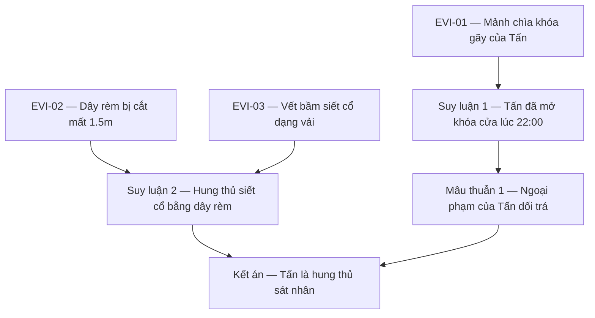

# BẢN MẪU THIẾT KẾ KỸ THUẬT VỤ ÁN (CASE DESIGN TEMPLATE)

> **Nhiệm vụ Cốt lõi:** Tài liệu định dạng khung điền mẫu bắt buộc cho tệp `case_design.md` của các vụ án. Bản mẫu này quy định chi tiết cấu trúc đặc tả kỹ thuật logic, cơ sở dữ liệu chứng cứ, ma trận ngoại phạm và đồ thị lập luận kết án dùng để cấu hình dữ liệu game máy đọc (`case.json`).

---

# VỤ ÁN [MÃ SỐ]: [TÊN VỤ ÁN TIẾNG VIỆT] (TECHNICAL CASE DESIGN)

> **Cổng kích hoạt vụ án:** `[MÃ SỐ KÍCH HOẠT, Vd: NX-4471]`
> **Độ khó thiết lập:** [Dễ / Trung Bình / Khó / Chuyên Gia]
> **Thời lượng phá án ước tính:** [X phút]
> **Công cụ điều tra yêu cầu:** [Vd: Đèn UV, Trạm phân tích EXIF, Phòng thí nghiệm hóa sinh]

---

## 📅 01. Sự Thật Khách Quan & Dòng Thời Gian Thực Tế

### 1. Sự thật tuyệt đối (Canon Truth)
- [Mô tả chi tiết diễn biến vụ án thực tế đã xảy ra: hung thủ là ai, động cơ thật sự là gì, kế hoạch chuẩn bị và phương thức gây án cụ thể].

### 2. Dòng thời gian thực tế (Real Timeline)
*   **[Giờ:Phút]** — [Hành động vật lý diễn ra ở địa điểm nào, do ai thực hiện].
*   **[Giờ:Phút]** — [Hành động tiếp theo...]

---

## 🔤 02. Danh Mục Chứng Cứ & Manh Mối (Evidence & Clues)

Mỗi chứng cứ thu thập được tại hiện trường bắt buộc phải được mã hóa và định nghĩa dòng chảy thông tin giải mã dưới đây:

| Mã Chứng cứ | Tên vật thể | Vị trí xuất hiện | Phương pháp giải mã | Manh mối thu được (Clue) |
| :--- | :--- | :--- | :--- | :--- |
| `EVI-[MÃ]` | [Tên chứng cứ thô] | [Địa điểm/Cách lấy] | [Cách tương tác vật lý] | [Kết luận logic rút ra từ phân tích] |
| `EVI-01` | Mảnh chìa khóa phụ gãy | Kẹt trong ổ khóa cửa | So khớp vết nứt cơ học | Chìa bị vặn gãy từ bên ngoài xưởng. |
| `EVI-02` | ... | ... | ... | ... |

---

## 🎭 03. Ma Trận Nghi Phạm & Đối Chiếu Ngoại Phạm

Dùng để đối chiếu sự mâu thuẫn giữa lời khai chủ quan của nghi phạm với các chứng cứ khách quan thu thập được:

| Nhân Vật | Vai trò | Lời khai ngoại phạm | Chứng cứ mâu thuẫn | Giải mã thực tế (Contradiction) |
| :--- | :--- | :--- | :--- | :--- |
| [Tên nhân vật] | [Nghi phạm phụ / Hung thủ] | [Chi tiết lời khai về vị trí/thời gian] | `EVI-[MÃ]` | [Điểm mâu thuẫn bẻ gãy alibi] |
| Lê Trọng Tấn | Hung thủ | Ở nhà xem TV từ 21:30 - 23:00. | `EVI-01` | Chìa khóa riêng của Tấn bị gãy kẹt trong ổ khóa xưởng vẽ lúc 22:00. |
| ... | ... | ... | ... | ... |

---

## 📐 04. Đồ Thị Xâu Chuỗi Lập Luận Kết Án (Proof Chain Graph)

Đặc tả luồng logic khép kín mà người chơi bắt buộc phải kết nối thành công để hệ thống phê duyệt kết án. Cấu trúc đồ thị này sẽ được cấu hình trực tiếp vào `solution.requiredProofGraph` trong code:

*(Lưu ý: Mọi kịch bản thiết kế bắt buộc phải vẽ rõ đồ thị Proof Chain này để đảm bảo vụ án không có kẽ hở logic trước khi lập trình)*
