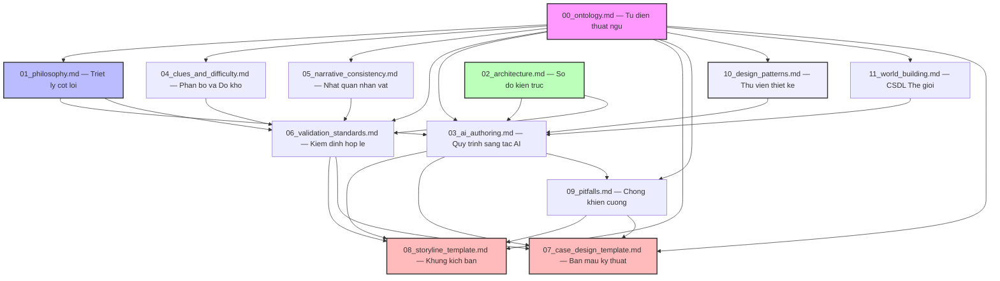

# BẢN ĐỒ PHỤ THUỘC TÀI LIỆU (DOCUMENTATION DEPENDENCY GRAPH)

> **Nhiệm vụ Cốt lõi:** Thiết lập ranh giới và quy chuẩn phụ thuộc (Dependency) giữa các tài liệu trong hệ thống. Ngăn chặn triệt để tình trạng tham chiếu vòng (Circular Reference) hoặc sao chép trùng lặp các quy tắc giữa các file.

---

## 🗺️ 01. Đồ Thị Phụ Thuộc Tài Liệu (Dependency Graph)

Mối liên hệ phụ thuộc giữa các tài liệu chính trong phân khu `11_investigation_design` được quy định nghiêm ngặt theo mô hình phân cấp từ trên xuống dưới (đỉnh đồ thị là nguồn chân lý tối cao):

---

## 🛠️ 02. Quy Tắc Bảo Trì Tài Liệu (Maintenance Rules)

Để đảm bảo hệ thống tài liệu không bị phình to hoặc mâu thuẫn khi sửa đổi, mọi đợt cập nhật bắt buộc phải tuân theo 3 nguyên tắc:

1. **Nguyên tắc Một Nguồn Chân Lý (Single Source of Truth):**
   - Mọi định nghĩa thuật ngữ chỉ được phép chỉnh sửa tại `00_ontology.md`. Các file khác chỉ trích dẫn hoặc sử dụng lại, tuyệt đối không định nghĩa lại.
   - Sơ đồ dòng chảy dữ liệu logic chỉ được chỉnh sửa tại `02_architecture.md`.
2. **Quy tắc Phụ thuộc Một Chiều (One-Way Dependency):**
   - Tài liệu tầng dưới (Vd: `08_storyline_template.md`) được phép tham chiếu đến tài liệu tầng trên (Vd: `03_ai_authoring.md`), nhưng tài liệu tầng trên tuyệt đối không được chứa nội dung hay phụ thuộc vào tài liệu tầng dưới.
3. **Cấm Tham Chiếu Vòng (No Circular References):**

   - Nghiêm cấm việc File A trích dẫn File B trong khi File B cũng trích dẫn File A. Mọi vòng lặp tham chiếu phát hiện khi playtest tài liệu sẽ bị coi là lỗi cấu trúc nghiêm trọng.
