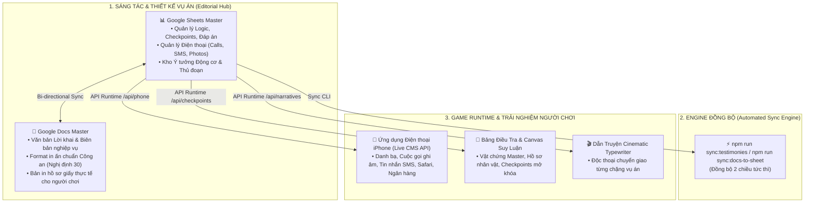
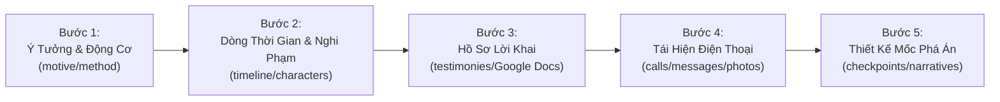

# 🕵️ Quy Trình Thiết Kế Game & Đặc Tả Google Sheets Live CMS

> **Tài liệu chuẩn hóa**: Quy trình sáng tác kịch bản, thiết kế vụ án, điều tra vật chứng, nhật ký điện thoại và cơ chế Live CMS thời gian thực cho dự án **Detective Case System (dect_project)**.
>
> 📌 **Google Sheet Master ID**: [`1h2P9VaBC9PELUMhipo6ze1SkJIVv3IOm5SP3ynURm4Q`](https://docs.google.com/spreadsheets/d/1h2P9VaBC9PELUMhipo6ze1SkJIVv3IOm5SP3ynURm4Q/edit)  
> 📄 **Master Google Docs (Tập Hồ Sơ Lời Khai)**: [`[Case 000] Hồ Sơ Lời Khai Master`](https://docs.google.com/document/d/1pJxlZpfCfIbnQ0YGx3mvCUmYTRng7zLyDxJ2EggJkgc/edit)  
> 📁 **Google Drive Folder**: [`DECT_CASE_000_DOCS`](https://drive.google.com/drive/folders/169qDUO29Us_LOcPGo1eEU-DV9nliTAfw)

---

## 🗺️ PHẦN I: KIẾN TRÚC TỔNG THỂ HỆ THỐNG VỤ ÁN (ARCHITECTURE MAP)

Hệ thống được thiết kế theo mô hình **Tam Giác Đồng Bộ (Headless Case Architecture)** giúp Game Designer, Biên kịch và Kỹ sư làm việc độc lập mà không bao giờ bị lệch dữ liệu:

---

## 🔄 PHẦN II: QUY TRÌNH 5 BƯỚC SÁNG TÁC VÀ THIẾT KẾ VỤ ÁN (GAME DESIGN WORKFLOW)

Khi xây dựng một vụ án mới (Case #000, Case #001...), Game Designer tuân theo 5 bước tuần tự:

---

### 🟢 Bước 1: Khởi Tạo Ý Tưởng, Động Cơ & Thủ Đoạn Gây Án
- **Mục tiêu**: Xác định bản chất vụ án (Án mạng trả thù, siết nợ, chiếm đoạt tài sản, hay án mạng liên hoàn).
- **Tab thực hiện trên Sheet**:
  - `motive_ideas`: Chọn mẫu động cơ tâm lý (Tài chính, Tình ái, Uất ức thù hằn, Che giấu tội ác quá khứ).
  - `method_ideas`: Chọn thủ đoạn gây án, cơ chế pháp y tử thi, thủ thuật tạo chứng cứ ngoại phạm và lỗ hổng điều tra.

---

### 🟢 Bước 2: Xây Dựng Dòng Thời Gian Vụ Án & Mạng Lưới Nhân Vật
- **Mục tiêu**: Lập bảng thời gian thực (Truth Timeline) đối chiếu với bảng thời gian gian dối (Fake Timeline).
- **Tab thực hiện trên Sheet**:
  - `characters`: Tạo danh sách nghi phạm, nhân chứng, mối quan hệ, đặc điểm nhận dạng.
  - `timeline`: Nhập từng mốc sự kiện theo phút (18:30, 19:45, 20h00, 20h45, 21h00, 21h15...). Đánh dấu sự kiện chí mạng (`is_fatal = TRUE`).
  - `relations`: Định nghĩa mối quan hệ dây mơ rễ má giữa các nhân vật.

---

### 🟢 Bước 3: Biên Soạn Hồ Sơ Lời Khai & Biên Bản Thẩm Vấn (Google Docs)
- **Mục tiêu**: Tạo ra các biên bản hỏi cung, lấy lời khai nhân chứng có mâu thuẫn để người chơi phát hiện lỗ hổng.
- **Cách thực hiện**:
  1. Nhập danh mục văn bản vào tab `testimonies` trên Sheet (Mã văn bản `06`, `07`, `08`, Họ tên, Mốc giờ, Cán bộ, Tóm tắt ngoại phạm).
  2. Mở file **Master Google Docs** để biên soạn câu chữ đối thoại, câu hỏi và câu trả lời.
  3. Khi cần cập nhật đồng bộ giữa Docs và Sheet: Chạy lệnh `npm run sync:docs-to-sheet` hoặc `npm run format:gdocs`.

---

### 🟢 Bước 4: Tái Hiện Hiện Trường Điện Thoại Nạn Nhân / Nghi Phạm
- **Mục tiêu**: Người chơi mở chiếc điện thoại thu giữ được tại hiện trường để bắt đầu bóc tách manh mối.
- **Tab thực hiện trên Sheet**:
  - `contacts`: Danh bạ điện thoại của nạn nhân (bao gồm các số nghi vấn, tên lưu ẩn dụ).
  - `calls`: Lịch sử cuộc gọi đến/đi/nhỡ, các cuộc gọi có đoạn ghi âm giọng nói / tiếng động hiện trường (`is_key_clue = TRUE`).
  - `messages`: Lịch sử nhắn tin SMS/Zalo, các tin nhắn đe dọa đòi nợ, nhắn tin hẹn gặp.
  - `photos`: Thư viện ảnh hiện trường, giấy tờ vay nợ, ảnh chụp ngoại phạm, ảnh căn cước.
  - `banking`: Lịch sử chuyển tiền ngân hàng, các giao dịch bất thường trước giờ nạn nhân tử vong.
  - `notes_and_browser`: Ghi chú cá nhân, nhật ký chi tiêu và lịch sử duyệt web của nạn nhân.

---

### 🟢 Bước 5: Thiết Kế Mốc Phá Án, Hệ Thống Gợi Ý & Dẫn Truyện Cinematic
- **Mục tiêu**: Định tuyến trải nghiệm phá án qua từng chặng (Phases: Mở đầu ➔ Bộ A ➔ Bộ B ➔ Bộ C ➔ Bản Cáo Trạng Định Tội).
- **Tab thực hiện trên Sheet**:
  - `checkpoints`: Tạo các câu hỏi suy luận, chọn nghi phạm, chọn mã vật chứng kết hợp, nhập đáp án (`answers`) và gợi ý đa cấp (`hints`).
  - `narratives`: Viết đoạn độc thoại cinematic máy đánh chữ khi người chơi mở khóa từng chặng.
  - `evidences`: Định danh toàn bộ thẻ vật chứng in trên bàn điều tra (`dev-00`, `06`, `10`, `p6`...).

---

## 📑 PHẦN III: ĐẶC TẢ CHI TIẾT TẤT CẢ CÁC TAB TRÊN GOOGLE SHEET MASTER

### 🏷️ Quy Ước Ký Hiệu Phân Loại Cột:
- 🔴 **`🔑 Core Identifier`**: Khóa ID kỹ thuật bắt buộc code dùng để map dữ liệu và định tuyến logic.
- 🟢 **`⚡ Live Reactive`**: Dữ liệu đọc trực tiếp runtime qua API (Sửa trên Sheet là web đổi ngay tức thì).
- ⚪ **`📝 Editorial Note`**: Ghi chú nghiệp vụ phân loại cho Game Designer/Biên kịch (Code bỏ qua).

---

### 1. Tab `testimonies` — Hồ Sơ Lời Khai & Biên Bản Thẩm Vấn (Google Docs)

| Cột | Tên trường | Loại | Ý nghĩa & Quy ước |
| :---: | :--- | :---: | :--- |
| 1 | `case_id` | 🔴 `🔑` | ID vụ án (`case_000`, `case_001`). |
| 2 | `doc_code` | 🔴 `🔑` | Mã số văn bản (`06`, `07`, `08`, `09`, `12`, `A02`, `B01`...). |
| 3 | `phase` | 🔴 `🔑` | Phân chặng (`00_khoi_dau`, `01_nhanh_mai_vu`, `02_nhanh_tung`, `03_nhanh_ha`). |
| 4 | `person_name` | 🟢 `⚡` | Họ tên người khai báo (`Nguyễn Ngọc Mai`, `Lê Quang Vũ`...). |
| 5 | `role` | 🟢 `⚡` | Tư cách tham gia tố tụng (Nhân chứng, Nghi phạm, Bị can). |
| 6 | `doc_title` | 🟢 `⚡` | Tiêu đề văn bản (`BIÊN BẢN LẤY LỜI KHAI`, `BẢN TỰ THÚ`...). |
| 7 | `doc_number` | 🟢 `⚡` | Số công văn lưu trữ (`07/BB-LK`). |
| 8 | `time_taken` | 🟢 `⚡` | Thời gian lập biên bản (`14h00 ngày 25/07/2016`). |
| 10 | `location` | 🟢 `⚡` | Địa điểm lập biên bản. |
| 11 | `officer` | 🟢 `⚡` | Cán bộ điều tra phụ trách (`Đại úy Lê Minh`). |
| 12 | `participants` | 🟢 `⚡` | Thành phần tham gia. |
| 13 | `core_content` | 🟢 `⚡` | Tóm tắt các ý chính / key clues của lời khai. |
| 14 | `alibi_claim` | 🟢 `⚡` | Tóm tắt luận điểm ngoại phạm đối tượng khai. |
| 15 | `clue_flaw` | 🟢 `⚡` | Lỗ hổng / mâu thuẫn để người chơi bóc trần. |
| 16 | `gdoc_tab_title` | 🟢 `⚡` | Tên Document Tab trên Master Google Doc. |
| 17 | `gdoc_url` | 🟢 `⚡` | Link trực tiếp tới Master Google Doc. |

---

### 1b. Tab `profiles` — Lý Lịch & Nhân Thân Nhân Vật

| Cột | Tên trường | Loại | Ý nghĩa & Quy ước |
| :---: | :--- | :--- :--- | :--- |
| 1 | `case_id` | 🔴 `🔑` | ID vụ án (`case_000`). |
| 2 | `doc_code` | 🔴 `🔑` | Mã số văn bản (`04`, `05a`, `05b`, `05c`, `03`, `05`). |
| 3 | `phase` | 🔴 `🔑` | Phân chặng. |
| 4 | `person_name` | 🟢 `⚡` | Họ tên đối tượng được lập lý lịch. |
| 5 | `role` | 🟢 `⚡` | Vai trò trong vụ án (Nạn nhân, Nghi phạm, Nhân chứng). |
| 6 | `doc_title` | 🟢 `⚡` | Tiêu đề tài liệu (`BẢN TRÍCH LỤC LÝ LỊCH VÀ MỐI QUAN HỆ`...). |
| 7 | `doc_number` | 🟢 `⚡` | Số hiệu lưu trữ. |
| 8 | `time_taken` | 🟢 `⚡` | Thời điểm lập hồ sơ. |
| 9 | `location` | 🟢 `⚡` | Đơn vị / địa điểm thụ lý. |
| 10 | `officer` | 🟢 `⚡` | Cán bộ lập hồ sơ. |
| 11 | `participants` | 🟢 `⚡` | Người phối hợp cung cấp thông tin. |
| 12 | `core_content` | 🟢 `⚡` | Tóm tắt nhân thân, gia cảnh, nghề nghiệp. |
| 13 | `background_motive`| 🟢 `⚡` | Động cơ ngầm / quan hệ tiền bạc, tình cảm. |
| 14 | `criminal_history` | 🟢 `⚡` | Tiền án, tiền sự hoặc biểu hiện bất minh. |
| 15 | `gdoc_tab_title` | 🟢 `⚡` | Tên Document Tab trên Master Google Doc. |
| 16 | `gdoc_url` | 🟢 `⚡` | Link trực tiếp tới Master Google Doc. |

---

### 1c. Tab `reports` — Biên Bản Hiện Trường, Khám Nghiệm & Khám Xét

| Cột | Tên trường | Loại | Ý nghĩa & Quy ước |
| :---: | :--- | :--- :--- | :--- |
| 1 | `case_id` | 🔴 `🔑` | ID vụ án (`case_000`). |
| 2 | `doc_code` | 🔴 `🔑` | Mã văn bản (`01`, `03a`, `03b`, `03`). |
| 3 | `phase` | 🔴 `🔑` | Phân chặng. |
| 4 | `subject_name` | 🟢 `⚡` | Đối tượng / Hiện trường khám xét. |
| 5 | `report_type` | 🟢 `⚡` | Loại biên bản (Tin báo, Hiện trường, Khám nghiệm tử thi, Khám xét). |
| 6 | `doc_title` | 🟢 `⚡` | Tiêu đề văn bản. |
| 7 | `doc_number` | 🟢 `⚡` | Số công văn lưu trữ. |
| 8 | `time_taken` | 🟢 `⚡` | Thời gian lập biên bản. |
| 9 | `location` | 🟢 `⚡` | Địa điểm tiến hành nghiệp vụ. |
| 10 | `officer` | 🟢 `⚡` | Cán bộ chủ trì. |
| 11 | `participants` | 🟢 `⚡` | Thành phần tham gia, kiểm sát viên, chứng kiến. |
| 12 | `core_content` | 🟢 `⚡` | Tóm tắt diễn biến tiếp nhận / khám nghiệm. |
| 13 | `key_findings` | 🟢 `⚡` | Dấu vết, vật chứng, tổn thương quan trọng thu thập được. |
| 14 | `gdoc_tab_title` | 🟢 `⚡` | Tên Document Tab trên Master Google Doc. |
| 15 | `gdoc_url` | 🟢 `⚡` | Link trực tiếp tới Master Google Doc. |

---

### 2. Tab `contacts` — Danh Bạ Điện Thoại Nạn Nhân

| Cột | Tên trường | Loại | Ý nghĩa |
| :---: | :--- | :---: | :--- |
| 1 | `case_id` | 🔴 `🔑` | Mã vụ án (`case_000`). |
| 2 | `contact_id` | 🔴 `🔑` | ID danh bạ (`c-mai`, `c-vu`, `c-ha`, `c-tung`...). |
| 3 | `name` | 🟢 `⚡` | Tên hiển thị trong danh bạ (`Mai Em Họ`, `Vũ Rể`, `Hà Vợ Iu`...). |
| 4 | `phone_number`| 🟢 `⚡` | Số điện thoại (`0988.200.991`, `0912.345.678`...). |
| 5 | `category` | 🟢 `⚡` | Nhóm (`Gia đình`, `Công việc`, `Nợ nần`, `Dịch vụ`). |
| 6 | `note` | 🟢 `⚡` | Ghi chú trong danh bạ điện thoại. |

---

### 3. Tab `calls` — Lịch Sử Cuộc Gọi & Hộp Thư Thoại Ghi Âm

| Cột | Tên trường | Loại | Ý nghĩa |
| :---: | :--- | :---: | :--- |
| 1 | `case_id` | 🔴 `🔑` | Mã vụ án. |
| 2 | `call_id` | 🔴 `🔑` | Khóa cuộc gọi (`call-01`, `call-ha-voicemail`...). |
| 3 | `date_str` | 🟢 `⚡` | Ngày gọi (`24/07/2016`). |
| 4 | `time_str` | 🟢 `⚡` | Giờ gọi (`21:12`, `20:45`...). |
| 5 | `display_name`| 🟢 `⚡` | Tên người gọi / người nhận. |
| 6 | `phone_number`| 🟢 `⚡` | Số điện thoại. |
| 7 | `call_type` | 🟢 `⚡` | `incoming` (đến), `outgoing` (đi), `missed` (nhỡ). |
| 8 | `is_missed` | 🟢 `⚡` | `TRUE` nếu là cuộc gọi nhỡ. |
| 9 | `is_key_clue` | 🟢 `⚡` | `TRUE` nếu có đoạn ghi âm âm thanh manh mối quan trọng. |

---

### 4. Tab `messages` — Tin Nhắn SMS / Trao Đổi Bí Mật

| Cột | Tên trường | Loại | Ý nghĩa |
| :---: | :--- | :---: | :--- |
| 1 | `case_id` | 🔴 `🔑` | Mã vụ án. |
| 2 | `contact_name`| 🔴 `🔑` | Tên người nhắn trong hội thoại. |
| 3 | `phone_number`| 🟢 `⚡` | Số điện thoại đối phương. |
| 4 | `avatar_color`| 🟢 `⚡` | Màu avatar đại diện (`blue`, `emerald`, `amber`, `rose`). |
| 5 | `unread` | 🟢 `⚡` | Số tin nhắn chưa đọc (`0`, `1`, `2`...). |
| 6 | `timestamp` | 🟢 `⚡` | Thời gian gửi tin nhắn cuối cùng (`24/07 20:55`). |
| 7 | `preview_text`| 🟢 `⚡` | Đoạn xem trước tin nhắn ở danh sách. |
| 8 | `messages_text`| 🟢 `⚡` | Toàn bộ các dòng chat (Cú pháp: `incoming: nội dung` hoặc `outgoing: nội dung`). |

---

### 5. Tab `photos` — Thư Viện Ảnh Bằng Chứng, Nghi Phạm & Dynamic Composite

| Cột | Tên trường | Loại | Ý nghĩa & Quy ước |
| :---: | :--- | :---: | :--- |
| 1 | `case_id` | 🔴 `🔑` | Mã vụ án (`case_000`, `case_001`). |
| 2 | `photo_code` | 🔴 `🔑` | Mã ảnh (`avatar_khang`, `avatar_vu`, `avatar_ha`, `p1`, `p2`...). |
| 3 | `title` | 🟢 `⚡` | Tiêu đề ảnh / Tên nhân vật (Hệ thống tự bóc tách để in hoa lên băng dính). |
| 4 | `category` | 🟢 `⚡` | Phân loại (`AVATAR`, `EVIDENCE`, `SCENE`, `HOTSPOT`). |
| 5 | `file_name` | 🟢 `⚡` | Tên file quy ước lưu trữ (`Ảnh_Hà.png`, `avata_khang.png`...). |
| 6 | `ratio` | 📝 | Tỉ lệ khung hình (`3:4`, `16:9`, `1:1`). |
| 7 | `local_file_path`| 📝 | Đường dẫn file gốc lưu tại `docs/cases/<case_id>/...` |
| 8 | `drive_url` | 🟢 `⚡` | **Link chia sẻ Google Drive công khai** (`https://drive.google.com/file/d/{id}/view`). Hệ thống tự chuyển thành Google CDN direct link. |
| 9 | `direct_cdn_url` | 🟢 `⚡` | Đường dẫn CDN trực tiếp (nếu có, ưu tiên cao nhất). |
| 10 | `description_prompt` | 🟢 `⚡` | Mô tả prompt ngoại hình nhân vật hoặc vật chứng. |
| 11 | `is_key_asset`| 🟢 `⚡` | `TRUE` nếu là ảnh vật chứng mấu chốt để bóc trần hung thủ. |

#### 🖼️ Giao thức Live Dynamic Composite & Bộ Nhớ Đệm Offscreen Canvas:
1. **Mô hình Live 100% không cần Build lại**:
   - Khi GM/Designer tải một ảnh khuôn mặt bất kỳ lên Google Drive và dán link vào cột `drive_url`, Web Client tự động tải ảnh về và áp dụng công nghệ **Dynamic Composite (Ghép khung động)**.
   - Trình duyệt tự động bo khung ảnh Polaroid trắng ngà, tạo miếng băng dính giấy răng cưa (masking tape) đè lên chân ảnh và in hoa tên nhân vật lấy từ Sheet.
2. **Tối ưu Hiệu năng 60 FPS (Offscreen Canvas Caching)**:
   - Toàn bộ quá trình ghép khung Polaroid và vẽ băng dính chỉ thực hiện **ĐÚNG 1 LẦN DUY NHẤT** vào một `OffscreenCanvas` trong bộ nhớ RAM khi ảnh tải về.
   - Khi người chơi kéo chuột, phóng to/thu nhỏ trên bàn điều tra 60 FPS, Web Canvas chỉ copy trực tiếp Bitmap từ RAM ra màn hình với độ trễ siêu tốc (<0.1ms), hoàn toàn không tính toán lại ziczac băng dính, không gây nóng máy hay tụt khung hình.
3. **Cơ chế An toàn Tuyệt đối (Graceful Fallback)**:
   - Nếu link Google Drive chưa bật quyền *"Bất kỳ ai có liên kết đều có thể xem"* (lỗi 403) hoặc mất mạng, hệ thống tự động fallback âm thầm về ảnh thẻ local tương ứng trong `public/images/cases/case_000/`, đảm bảo không bao giờ vỡ giao diện hay hiện icon ảnh lỗi.
4. **Quy chuẩn dành cho Biên kịch & Designer**:
   - **Quyền file trên Drive**: Luôn bật quyền *Viewer - Anyone with the link* (Người xem có liên kết).
   - **Tỉ lệ ảnh chân dung**: Khuyến nghị tỉ lệ `3:4` hoặc `1:1`, góc chụp từ ngực trở lên, rõ nét khuôn mặt.
   - **Dung lượng ảnh**: Khuyến nghị < 1.5MB để người chơi trên mạng 4G di động tải mượt mà.

---

### 6. Tab `banking` — Lịch Sử Giao Dịch Ngân Hàng

| Cột | Tên trường | Loại | Ý nghĩa |
| :---: | :--- | :---: | :--- |
| 1 | `case_id` | 🔴 `🔑` | Mã vụ án. |
| 2 | `tx_id` | 🔴 `🔑` | Mã giao dịch (`tx-01`, `tx-02`...). |
| 3 | `ref_id` | 🟢 `⚡` | Mã tham chiếu ngân hàng (`FT1620589231`). |
| 4 | `title` | 🟢 `⚡` | Nội dung chuyển khoản. |
| 5 | `receiver` | 🟢 `⚡` | Tên người nhận / người gửi. |
| 6 | `account_no` | 🟢 `⚡` | Số tài khoản ngân hàng. |
| 7 | `amount` | 🟢 `⚡` | Số tiền giao dịch (`-50,000,000 VND`, `+200,000,000 VND`). |
| 8 | `timestamp` | 🟢 `⚡` | Thời gian thực hiện giao dịch. |
| 9 | `category` | 🟢 `⚡` | `income` (tiền vào) hoặc `expense` (tiền ra). |
| 10 | `is_evidence` | 🟢 `⚡` | `TRUE` nếu là giao dịch chứng minh động cơ phạm tội. |

---

### 7. Tab `checkpoints` — Hệ Thống Câu Hỏi, Đáp Án & Mở Khóa Chặng

| Cột | Tên trường | Loại | Mô tả & Quy ước |
| :---: | :--- | :---: | :--- |
| 1 | `case_id` | 🔴 `🔑` | Mã vụ án (`case_000`). |
| 2 | `checkpoint_id`| 🔴 `🔑` | Khóa chính duy nhất đại diện cho cả mốc tiến trình và ghim câu hỏi trên Canvas (`cp-000-0`, `cp-000-1a`, `cp-000-1b`, `cp-000-1c`, `cp-000-2b`...). Hệ thống hỗ trợ tương thích ngược tự nhận diện `node_id` nếu có. |
| 3 | `dossier` | ⚪ `📝` | Nhãn bộ hồ sơ (`Ban Đầu`, `Bộ A`, `Bộ B`, `Bộ C`). |
| 4 | `title` | 🟢 `⚡` | Tiêu đề câu hỏi / thử thách. |
| 5 | `question` | 🟢 `⚡` | Lời dẫn yêu cầu điều tra chi tiết. |
| 6 | `type` | 🔴 `🔑` | `evidence_picker` (chọn vật chứng + người), `text_match_3` (điền 3 ô), `mcq` (trắc nghiệm), `text` (nhập tự do). |
| 7 | `answers` | 🟢 `⚡` | **Đáp án hợp nhất**: Dùng cú pháp `nghi_pham:`, `ma_chung_cu:`, `o_nhap:`, `dap_an:` (Alt+Enter xuống dòng). |
| 8 | `hints` | 🟢 `⚡` | **Gợi ý đa cấp**: Mỗi dòng Alt+Enter là 1 cấp độ gợi ý (Cấp 1 ➔ Cấp 2 ➔ Đáp án gợi mở). |

> 📌 **Ghi chú Tinh gọn Schema**:
> - Đã gộp `node_id` vào `checkpoint_id` (dùng chung 1 mã khóa duy nhất).
> - Đã loại bỏ cột `unlocked_evidence_id` dư thừa vì tiến trình mở khóa hồ sơ được tự động quản lý theo Phase và logic nghiệp vụ.

---

### 8. Tab `narratives` — Dẫn Truyện Cinematic Typewriter

| Cột | Tên trường | Loại | Mô tả |
| :---: | :--- | :---: | :--- |
| 1 | `case_id` | 🔴 `🔑` | Mã vụ án. |
| 2 | `phase` | 🔴 `🔑` | `0` = Ban Đầu, `1` = Mở Bộ A, `2` = Mở Bộ B, `3` = Mở Bộ C. |
| 3 | `dossier` | ⚪ `📝` | Tên chặng. |
| 4 | `date` | 🟢 `⚡` | Mốc thời gian hiển thị trên header modal (`Đêm 24/07/2016`). |
| 5 | `monologue` | 🟢 `⚡` | Nội dung lời dẫn chạy chữ máy đánh chữ cinematic (Alt+Enter ngắt đoạn). |

---

## 🛠️ PHẦN IV: CẨM NANG THAO TÁC LỆNH 1-CHẠM (CLI TOOLBOX)

| Lệnh Dòng Lệnh | Chức Năng | Khi Nào Sử Dụng? |
| :--- | :--- | :--- |
| `npm run export:docs-pdf` | Xuất bản toàn bộ 21 Document Tabs từ Master Google Docs thành PDF | Khi cần cập nhật các file PDF hồ sơ hiển thị trên web app. |
| `npm run build:master-doc` | Khởi tạo / dựng lại toàn bộ 21 Document Tabs trên Master Google Docs & Sheet | Khi khởi tạo hoặc reset lại cấu trúc tài liệu Master. |
| `npm run sync:docs-to-sheet` | Đọc toàn bộ nội dung từ Google Docs và lưu ngược vào Sheet | Khi bạn vừa viết hoặc sửa văn phong trực tiếp trong file Google Docs. |
| `npm run sync:testimonies` | Kéo toàn bộ dữ liệu từ Sheet về file Markdown local trong repo | Khi chuẩn bị commit Git hoặc kiểm tra tài liệu local. |

---

## 🛡️ PHẦN V: CƠ CHẾ FALLBACK 2 TẦNG BẢO VỆ GAME

1. **Tầng 1 — Fallback từng ô (Cell-Level Fallback)**:
   - Nếu Game Designer để trống một ô bất kỳ trên Google Sheet, app tự động lấy giá trị mặc định từ file local cùng ID mà không bị lỗi giao diện.
2. **Tầng 2 — Fallback toàn bộ Tab (Table-Level Fallback)**:
   - Nếu mất mạng, mạng yếu hoặc Google API gặp sự cố, hệ thống tự động chuyển sang đọc file JSON local tĩnh (`content/cases/`), đảm bảo game chạy liên tục 100% không bao giờ crash.
